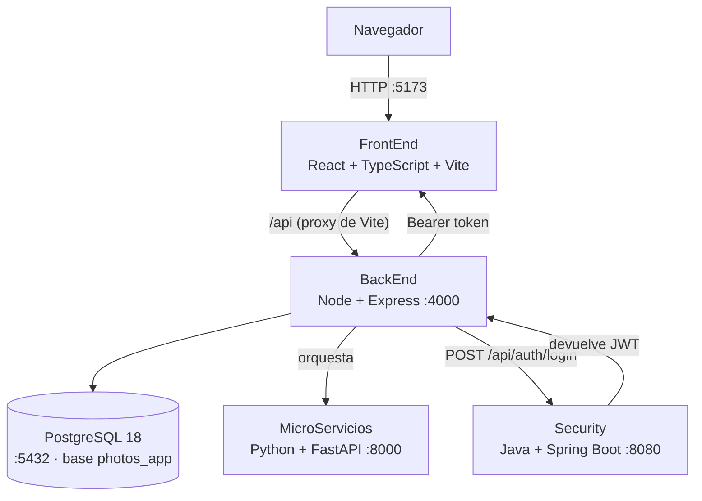

# Photos APP

Red social privada para una familia. Cada miembro comparte publicaciones escritas y
fotografias con el resto del circulo, en lugar de saturar el grupo de WhatsApp.

Proyecto educativo de la asignatura de Desarrollo de Software: sirve para practicar
analisis de requisitos, UML, bases de datos, arquitectura y despliegue.

## Estado del proyecto

Fase de documentacion y esqueleto. Esto es lo que hay y lo que falta:

| Modulo | Estado |
| ------ | ------ |
| Diagramas | **Completo**: 25 diagramas en 5 tipos ([indice](docs/diagramas/README.md)) |
| Diagramas de casos de uso | 7 diagramas, 47 casos de uso ([docs/casos-de-uso.md](docs/casos-de-uso.md)) |
| Diagramas de clases | 4 diagramas, autocontenidos, con las decisiones justificadas ([docs/clases.md](docs/clases.md)) |
| Diagramas de secuencia | 8 diagramas. Solo el de iniciar sesion existe en codigo; los demas **especifican lo que falta** ([docs/secuencia.md](docs/secuencia.md)) |
| Diagramas de comunicacion | 4 diagramas ([docs/comunicacion.md](docs/comunicacion.md)) |
| Diagramas de despliegue | 2 diagramas: desarrollo real y produccion marcada como no implementada ([docs/despliegue.md](docs/despliegue.md)) |
| Autenticacion JWT | Parcial: el login emite token, pero **nadie lo valida todavia** (ver [Autenticacion](#autenticacion)) |
| Gestion de fotos | Funcional: listar, ver, crear y borrar. Sin editar |
| Publicaciones, comentarios, reacciones | **Pendiente**: definido en los casos de uso, sin implementar |
| Registro por invitacion | **Pendiente**: definido en los casos de uso, sin implementar |
| Modelo entidad-relacion | **Pendiente**: es el paso natural despues de los diagramas de clases |
| Arquitectura de software | **Pendiente** |
| Pruebas | Solo en `Security` y `MicroServicios`; `FrontEnd` y `BackEnd` sin tests |

## Arquitectura

El sistema son cuatro servicios independientes, cada uno con su lenguaje y su puerto.
`BackEnd` es el punto de entrada: recibe las peticiones del navegador y las coordina.



### Partes del proyecto

| Parte | Tecnologia | Puerto | Que hace |
| ----- | ---------- | ------ | -------- |
| [`FrontEnd/`](FrontEnd) | React 19 + TypeScript + Vite | 5173 | Interfaz web para el usuario |
| [`BackEnd/`](BackEnd) | Node.js 24 + TypeScript + Express | 4000 | API principal: orquesta y expone los datos |
| [`Security/`](Security) | Java 21 + Spring Boot + Security | 8080 | Autenticacion y autorizacion (JWT) |
| [`MicroServicios/`](MicroServicios) | Python 3 + FastAPI | 8000 | Microservicio de fotos |

### Flujo de autenticacion

1. El usuario envia usuario y contrasena desde `FrontEnd` a `POST /api/auth/login`.
2. `BackEnd` reenvia las credenciales a `Security` (`POST /api/auth/login`).
3. `Security` valida contra los usuarios de `application.yml` y devuelve un JWT.
4. `BackEnd` devuelve el token al `FrontEnd`, que lo guarda en `localStorage`.
5. `FrontEnd` envia el token en la cabecera `Authorization: Bearer <token>`.

En desarrollo `FrontEnd` usa el proxy de Vite para `/api`, de forma que no hay
problemas de CORS entre el navegador y `BackEnd`.

### Autenticacion

> **Lo que hay y lo que falta.** `Security` emite y firma el token correctamente, y
> `FrontEnd` ya lo envia en cada peticion. Lo que **no** hay todavia es la validacion
> del lado del `BackEnd`: no existe ningun middleware que compruebe el token, asi que
> `GET /api/photos` responde igual con o sin `Authorization`. `JWT_SECRET` esta en
> `BackEnd/.env` pero hoy no se usa para nada.
>
> Hasta que se anada ese middleware, el unico punto donde se comprueban las
> credenciales es `Security`. Es el siguiente paso antes de exponer el sistema fuera de
> la red local.

Del lado del `FrontEnd` el token se guarda en `localStorage` bajo la clave
`access_token`, y `services/api.ts` lo anade a cada peticion con un interceptor de
axios. Dos avisos sobre eso: `localStorage` es accesible desde cualquier script de la
pagina, asi que es sensible a XSS, y todavia no hay cierre de sesion que borre el token
al pulsar salir. Ambas cosas se arreglan cuando se cierre la parte de autenticacion.

Lo que falta ademas, de cara al modelo de los casos de uso:

- `Security` valida contra usuarios fijos de `application.yml`. Con el registro por
  invitacion, los usuarios tienen que pasar a PostgreSQL.
- Los roles viajan en el token pero todavia no se usan para autorizar nada.

## Requisitos

| Herramienta | Version minima | Notas |
| ----------- | --------------- | ----- |
| Node.js | 20.19.0 | `engines` de `BackEnd` (20.0.0) y de Vite 8, que pide mas |
| npm | 10.0.0 | Incluido con Node |
| Java (JDK) | 21 | `java.version` de `Security/pom.xml` |
| Maven | 3.9 o superior | Opcional: el proyecto incluye `mvnw` |
| Python | 3.10 o superior | Con `venv` para `MicroServicios` |
| PostgreSQL | 14 o superior | Probado con 18. Base de datos de `BackEnd` |

> Detalle de las versiones instaladas en el entorno de desarrollo: ver
> [Entorno local](#entorno-local-wsl).

## Puesta en marcha

El orden importa: la base de datos tiene que estar viva antes de las migraciones, y
`Security` tiene que estar arriba antes de probar el login.

### 1. Base de datos

```bash
pg_start     # arranca PostgreSQL en localhost:5432
pg_status    # comprueba que responde
```

Los atajos `pg_start`, `pg_status` y `pg_stop` estan definidos en `~/.bashrc`; ver
[Base de datos](#base-de-datos-postgresql).

### 2. Security (Java + Spring Boot)

```bash
cd Security
./mvnw spring-boot:run     # o bien: mvn spring-boot:run
```

### 3. BackEnd (Node.js + Express)

```bash
cd BackEnd
npm install
cp .env.example .env
npm run db:create      # solo la primera vez
npm run db:migrate     # solo la primera vez
npm run db:seed        # opcional: 2 fotos de ejemplo
npm run dev
```

### 4. MicroServicios (Python + FastAPI)

```bash
cd MicroServicios
python3 -m venv .venv
.venv/bin/pip install -r requirements.txt
cp .env.example .env
.venv/bin/uvicorn app.main:app --reload --port 8000
```

> Si el paso `python3 -m venv` falla, ver
> [`python3 -m venv` no crea el venv](#problemas-frecuentes).

### 5. FrontEnd (React + TypeScript)

```bash
cd FrontEnd
npm install
cp .env.example .env
npm run dev
```

Cada servicio corre en su propia terminal. El puerto de cada uno esta en la tabla
[Partes del proyecto](#partes-del-proyecto); PostgreSQL usa el 5432. Si una conexion se
rechaza, casi siempre es que ese puerto ya esta ocupado por otro proceso.

## Comprobar que todo funciona

| Servicio | Comprobacion | Respuesta esperada |
| -------- | ------------ | ------------------ |
| BackEnd | `curl http://localhost:4000/api/health` | `"database":"connected"` |
| Security | `POST /api/auth/login` con `admin / admin123` | Un token JWT en el campo `token` |
| MicroServicios | `curl http://localhost:8000/api/v1/health` | Estado del servicio |
| FrontEnd | abrir <http://localhost:5173> | Pantalla de login |

La peticion completa al servicio de seguridad, para probarla desde la terminal:

```bash
curl -X POST http://localhost:8080/api/auth/login \
  -H 'Content-Type: application/json' \
  -d '{"username":"admin","password":"admin123"}'
```

El `BackEnd` **arranca aunque PostgreSQL este caido**, pero `/api/health` responde
`503` con `"database":"unavailable"`. Es intencionado: asi se puede arrancar el
servidor sin levantar la base de datos.

Usuarios de ejemplo en `Security`: `admin / admin123` (ADMIN, USER) y
`usuario / usuario123` (USER). Son credenciales de desarrollo local, definidas en
`application.yml`; no sirven para produccion.

## Estructura del proyecto

```
photos_APP/
  FrontEnd/          Interfaz web (React + TypeScript + Vite)
  BackEnd/           API principal (Node + Express + TypeORM)
  Security/          Autenticacion JWT (Java + Spring Boot)
  MicroServicios/    Microservicio de fotos (Python + FastAPI)
  docs/
    casos-de-uso.md       Analisis funcional: actores, 47 casos de uso y decisiones
    clases.md             Diagramas de clases y decisiones de modelado
    secuencia.md          Diagramas de secuencia, con el estado de cada flujo
    comunicacion.md       Diagramas de comunicacion
    despliegue.md         Diagramas de despliegue (desarrollo y produccion)
    sync-diagramas.ps1    Vuelca los .puml dentro de los .md
    diagramas/
      README.md           Indice de los 25 diagramas y como renderizarlos
      casos-de-uso/       7 .puml
      clases/             4 .puml
      secuencia/          8 .puml
      comunicacion/       4 .puml
      despliegue/         2 .puml
  .editorconfig      Formato de codigo compartido por las 4 partes
  .gitignore         Excluye node_modules, .env, target, .venv
  README.md
```

Cada parte tiene su propio `README.md` con el detalle de su estructura interna, sus
rutas y sus scripts. Este README es la vista general.

### Estructura del BackEnd

```
BackEnd/src/
  config/        database.ts (DataSource), env.ts
  controllers/   auth, health, photo
  routes/        index.ts agrupa las rutas; un archivo por recurso
  services/      photo.service.ts, security.service.ts
  entities/      Photo.ts
  migrations/    Migraciones versionadas de TypeORM
  database/cli/  Scripts de db:create, db:migrate, db:revert, db:seed
  middlewares/   404 y manejador global de errores
  utils/         AppError, asyncHandler, logger
```

`synchronize` esta en **false** a proposito: las tablas se crean solo con
migraciones, para que el esquema de la base de datos quede siempre bajo control.

## Comandos utiles

| Parte | Desarrollo | Build / produccion | Lint y formato | Tipos | Tests |
| ----- | --------- | ------------------ | -------------- | ----- | ----- |
| `FrontEnd` | `npm run dev` | `npm run build` | `npx eslint .` · `npx prettier .` | `npm run typecheck` | - |
| `BackEnd` | `npm run dev` | `npm run build && npm start` | `npm run lint` · `npm run format` | `npm run typecheck` | - |
| `Security` | `./mvnw spring-boot:run` | `./mvnw package` | - | `javac` compila en `package` | `./mvnw test` |
| `MicroServicios` | `.venv/bin/uvicorn app.main:app --reload` | - | `.venv/bin/ruff check .` · `.venv/bin/ruff format .` | - | `.venv/bin/pytest` |

En `BackEnd` hay tambien `npm run lint:fix` y `npm run format:check` (el segundo
comprueba el formato sin escribir archivos, util en integracion continua).

Scripts de base de datos, todos en `BackEnd`:

```bash
npm run db:create    # CREATE DATABASE si no existe
npm run db:migrate   # aplica las migraciones pendientes
npm run db:revert    # deshace la ultima migracion
npm run db:seed      # inserta datos de ejemplo si la tabla esta vacia
```

## Variables de entorno

Ningun `.env` esta en el repositorio. Cada parte trae su `.env.example`:

| Parte | Variables |
| ----- | --------- |
| `FrontEnd/.env.example` | `VITE_BACKEND_URL`, `VITE_API_URL`, `VITE_SECURITY_SERVICE_URL` |
| `BackEnd/.env.example` | `NODE_ENV`, `PORT`, `CORS_ORIGIN`, `SECURITY_SERVICE_URL`, `PHOTOS_SERVICE_URL`, `DB_HOST`, `DB_PORT`, `DB_NAME`, `DB_USER`, `DB_PASSWORD`, `DB_SSL`, `DB_LOGGING`. Mas `JWT_SECRET` y `JWT_EXPIRES_IN`, hoy sin uso (ver [Autenticacion](#autenticacion)) |
| `MicroServicios/.env.example` | `APP_NAME`, `APP_VERSION`, `DEBUG`, `HOST`, `PORT`, `BACKEND_URL`, `SECURITY_SERVICE_URL`, `DATABASE_URL` |
| `Security/src/main/resources/application.yml` | Puerto 8080, clave JWT y usuarios de ejemplo. La clave se sobreescribe con la variable de entorno `JWT_SECRET` |

Buenas practicas para este repositorio:

- `.env` esta en `.gitignore`. Se copia de `.env.example` y nunca se sube.
- Solo las variables con prefijo `VITE_` llegan al navegador. Ese prefijo es la unica
  forma de exponer una variable al cliente, asi que no lo pongas en una API key.
- La clave de JWT debe tener 32 caracteres o mas, y en `Security` conviene no dejar la
  que viene por defecto.

## Convenciones de codigo

Definidas en `.editorconfig` y aplicadas por las herramientas de cada parte:

- UTF-8, saltos de linea LF, sin espacios al final de linea.
- 2 espacios de indentacion; 4 para Java y Python.
- En TypeScript, comillas simples y ancho de linea de 100 (`.prettierrc.json`).
- En Python, `ruff format`; en Java no hay formateador automatico configurado, asi que
  hay que respetar el estilo del archivo que se edita.

Cuando dos reglas chocan, manda el formateador de cada parte (`prettier` en TypeScript,
`ruff` en Python) por encima de `.editorconfig`.

## Documentacion

| Documento | Contenido |
| --------- | --------- |
| [`docs/diagramas/README.md`](docs/diagramas/README.md) | **Indice de los 25 diagramas**, convenciones de nombres y como renderizar |
| [`docs/casos-de-uso.md`](docs/casos-de-uso.md) | Analisis funcional: actores, 47 casos de uso, relaciones y decisiones de negocio |
| [`docs/clases.md`](docs/clases.md) | 4 diagramas de clases y las 8 decisiones de modelado, con la cobertura UC a clase |
| [`docs/secuencia.md`](docs/secuencia.md) | 8 diagramas de secuencia, con una tabla de que flujo funciona hoy y cual no |
| [`docs/comunicacion.md`](docs/comunicacion.md) | 4 diagramas de comunicacion: quien habla con quien, sin orden |
| [`docs/despliegue.md`](docs/despliegue.md) | 2 diagramas de despliegue: el entorno real de desarrollo y el objetivo de produccion |
| `FrontEnd/README.md` · `BackEnd/README.md` · `Security/README.md` · `MicroServicios/README.md` | Detalle de cada parte |

Los diagramas se renderizan en <https://www.plantuml.com/plantuml> o con la extension
de Visual Studio Code para PlantUML. Cada documento incrusta el codigo de sus
diagramas, y `docs/sync-diagramas.ps1` lo refresca desde los `.puml` para que no
se desincronicen.

## Base de datos (PostgreSQL)

Base `photos_app`, usuario `postgres`, contrasena `postgres`: todo eso sale de
`BackEnd/.env.example` y se puede cambiar desde `BackEnd/.env`.

Atajos definidos en `~/.bashrc`:

```bash
pg_start        # arranca el servidor en localhost:5432
pg_status       # ver si esta corriendo
pg_stop         # detenerlo
psql -d photos_app
```

Si en algun momento PostgreSQL corre en Docker en vez de en local:

```bash
docker exec -it <contenedor> psql -U postgres -d photos_app
```

## Problemas frecuentes

**`npm run lint` falla en `FrontEnd`.** Ese `package.json` no define el script. Usa
`npx eslint .` y `npx prettier .` directamente, como indica su README.

**Vite o `tsx` fallan con un error de binario.** Los scripts de instalacion de npm 11
vienen bloqueados por defecto:

```bash
npm rebuild esbuild --foreground-scripts
```

**`python3 -m venv` no crea el venv.** Ubuntu 26.04 no trae `ensurepip`. Crea el venv
sin pip y luego instalalo:

```bash
python3 -m venv --without-pip .venv
curl -sSL https://bootstrap.pypa.io/get-pip.py | .venv/bin/python
```

**`psql` no encuentra las bibliotecas.** PostgreSQL esta en `~/opt` sin instalar con
`sudo`. Los helpers de `~/.bashrc` ya ajustan `LD_LIBRARY_PATH`; usa `pg_start` en vez
de llamar a `pg_ctl` a mano.

**`./mvnw` da error de permisos o de JDK.** El wrapper descarga Maven solo, pero sigue
necesitando un JDK 21 en el `PATH`. Comprueba con `java -version` y, si no aparece,
abre una terminal nueva para que se cargue el `PATH` (ver
[Entorno local](#entorno-local-wsl)).

## Entorno local (WSL)

Versiones instaladas en la maquina de desarrollo. Van aparte del proyecto porque son
detalles de este equipo, no requisitos del repositorio: si otra persona usa otras
versiones, el proyecto sigue funcionando igual.

| Herramienta | Version | Ubicacion |
| ----------- | ------- | --------- |
| Node.js | 24.21.0 | `~/.nvm/versions/node/v24.21.0` (via nvm) |
| npm | 11.19.0 | incluido con Node |
| Java (JDK) | 21.0.12 | `~/opt/jdk-21.0.12.1+1` |
| Maven | 3.9.16 | `~/opt/apache-maven-3.9.16` |
| PostgreSQL | 18.6 | `~/opt/pgsql18` (datos en `~/pgdata`) |
| Python | 3.14.4 | `/usr/bin/python3` |

Todo se instalo en el home del usuario, sin `sudo`. El `PATH` quedo configurado en
`~/.bashrc`: abre una terminal nueva de WSL para que reconozca `node`, `java`, `mvn`,
`psql` y `python3`.

Detalles que no son evidentes:

- Node se instalo con **nvm**.
- Python 3.14 de Ubuntu no trae `ensurepip`, por eso el venv se creo con
  `--without-pip` (ver [Problemas frecuentes](#problemas-frecuentes)).
- PostgreSQL se instalo descargando los `.deb` de Ubuntu y extrayendolos, sin `sudo`.
  Por eso el socket esta en `~/.pgsock` en vez de `/var/run/postgresql`.

## Licencia

Proyecto academico. Todos los derechos reservados.
