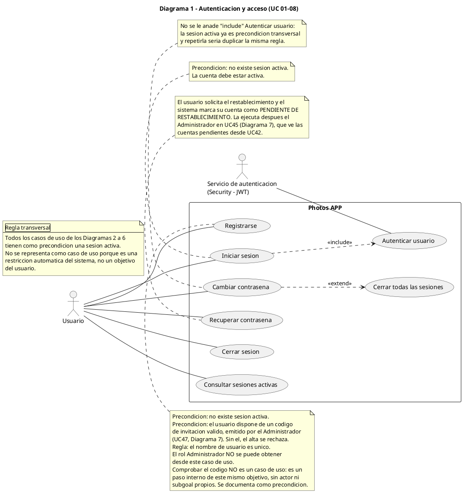
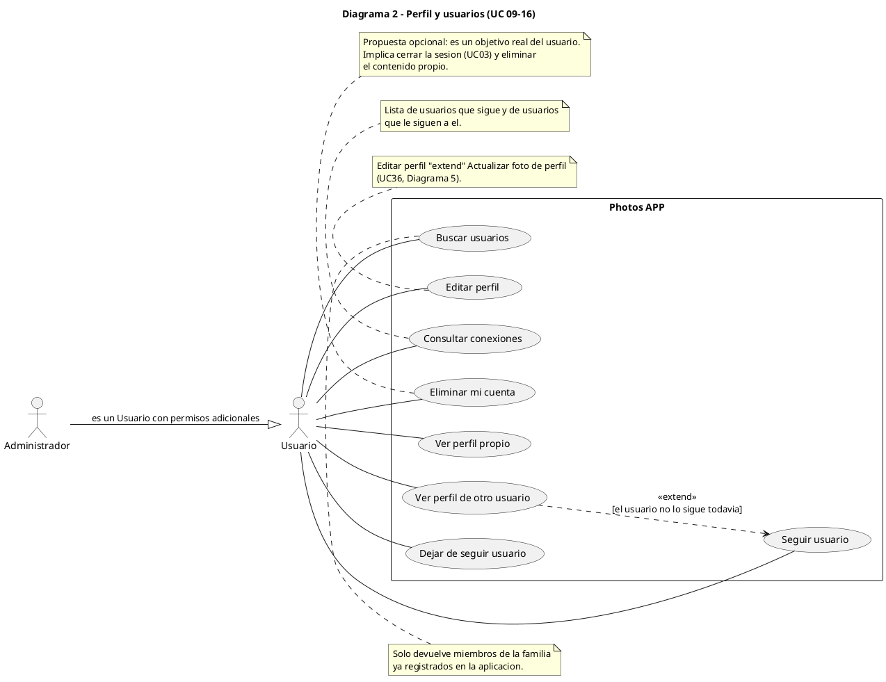
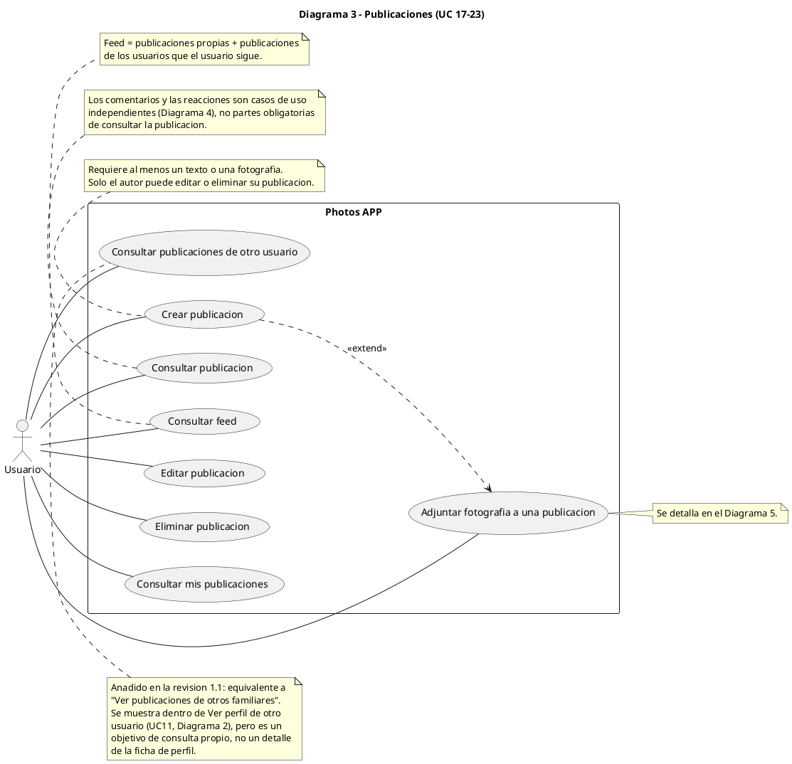
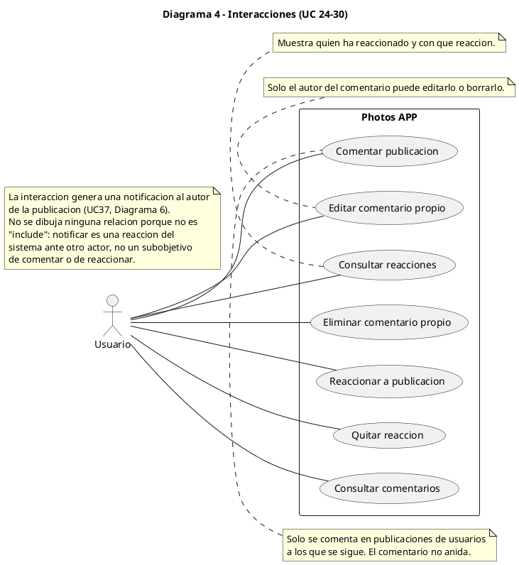
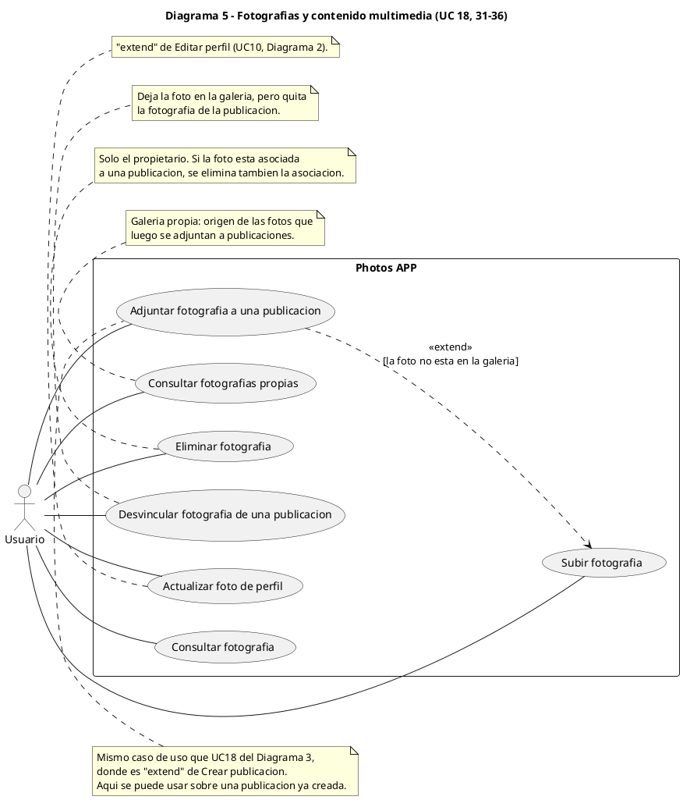
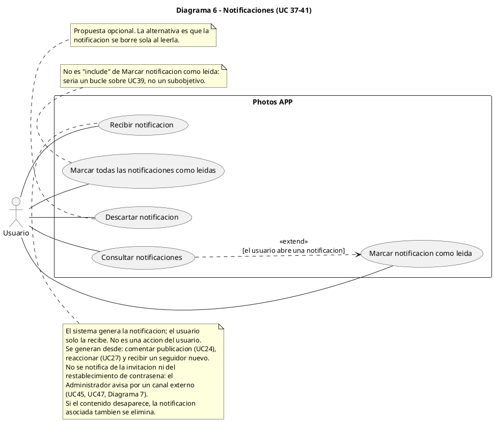
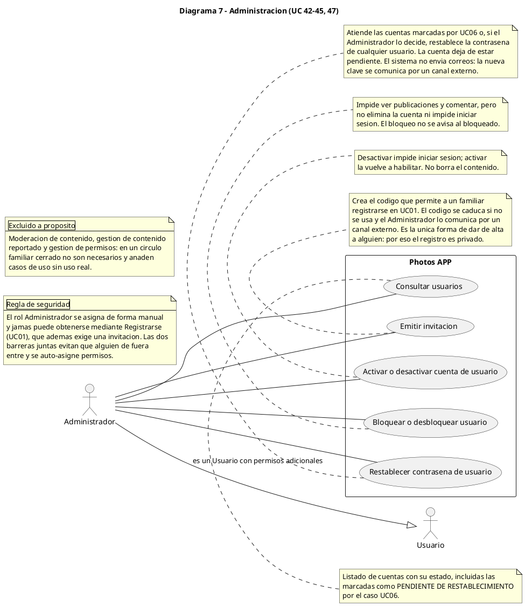

# Diagramas de casos de uso - Photos APP

Version 1.3 · Análisis de requisitos funcional. Es el **primer** documento del
modelo: de aquí salen los diagramas de clases, de secuencia, de comunicación y
de despliegue, que están cada uno en su propio fichero.

Diagramas en `docs/diagramas/casos-de-uso/` (PlantUML, 47 casos de uso numerados
UC01–UC47). El resto de vistas del modelo están en
[`clases.md`](clases.md), [`secuencia.md`](secuencia.md),
[`comunicacion.md`](comunicacion.md) y [`despliegue.md`](despliegue.md).

> v1.2: el registro pasa a ser **por invitación** y UC06 gana una postcondición real.
> El registro abierto de la v1.0 daba un contradictorio con el requisito de aplicación
> privada; la invitación lo resuelve con un solo caso de uso. Ver §4.

## Decisiones de negocio tomadas

| # | Tema | Decisión |
| - | ---- | -------- |
| 1 | Acceso | **Registro por invitación** (v1.2): nadie se da de alta por su cuenta, hace falta un código que emite el Administrador |
| 2 | Administrador | **Administrador mínimo**: consultar usuarios, activar/desactivar cuentas, bloquear/desbloquear, restablecer contraseña. Sin moderación |
| 3 | Relaciones | **Seguir unidireccional** (estilo Twitter). El feed muestra publicaciones propias + de los usuarios seguidos |
| 4 | Fotografías | **Galería propia independiente** y además asociación de fotos a publicaciones |
| 5 | Contraseña | **Restablecimiento por el Administrador**. Sin servicio de correo. El usuario marca la cuenta como pendiente (UC06) |
| 6 | Publicación | **Un solo caso de uso** "Crear publicación" con «extend» "Adjuntar fotografía" |

---

# 1. Análisis

## 1.1 Actores

### Usuario (actor principal)
Cualquier miembro de la familia. Se asocia a los 44 casos de uso de los Diagramas 1–6.

### Administrador (actor secundario, justificado)
Existe por dos razones concretas:

1. **Da de alta a la familia.** Es el único que emite invitaciones (UC47). Sin él, o
   el registro es abierto y la aplicación deja de ser privada, o nadie controla quién
   entra.
2. **Resuelve lo que el usuario no puede.** Restablece contraseñas (UC45) y reactiva
   cuentas desactivadas (UC43).

Un Administrador es además un Usuario (en el proyecto ya existe el rol `ADMIN` junto a
`USER`), por eso se modela con **generalización de actor** `Administrador --|> Usuario`
y no como un actor independiente. Así no hay que duplicar los casos de uso del usuario.

Casos de uso propios: UC42–UC45, UC47 (Diagrama 7).

### Servicio de autenticación (actor externo, justificado)
Está justificado **porque en este proyecto ya existe como sistema aparte**
(`Security/`, Java + Spring Boot, puerto 8080) que emite y valida el JWT. Al ser otro
sistema desplegable, es un actor de apoyo y se asocia a "Autenticar usuario" (UC08).

Si en el futuro se integrara dentro del `BackEnd`, este actor **desaparecería** del
diagrama: no modelamos arquitectura, modelamos los sistemas que participan.

### Actores descartados y por qué

| Actor descartado | Motivo |
| ---------------- | ------ |
| Servicio de almacenamiento de imágenes (S3, Cloudinary) | Las fotos van en PostgreSQL. Este actor solo sería necesario si se usara almacenamiento de objetos externo |
| Servicio de notificaciones | Las notificaciones son internas de la aplicación. Si algún día se avisara por correo, aparecería aquí |
| Servicio de correo electrónico | No hay recuperación por correo: la hace el Administrador |
| Navegador / FrontEnd | Son parte del sistema, no actores externos |
| Visitante / Usuario no registrado | Es un **estado** del mismo actor (no tiene sesión), no una persona distinta. Se modela como precondición, no como actor |

## 1.2 Casos de uso

47 casos de uso, numerados y agrupados:

| Diagrama | Rango | Cantidad |
| -------- | ----- | -------- |
| 1 · Autenticación y acceso | UC01–UC08 | 8 |
| 2 · Perfil y usuarios | UC09–UC16 | 8 |
| 3 · Publicaciones | UC17–UC23, UC46 | 8 |
| 4 · Interacciones | UC24–UC30 | 7 |
| 5 · Fotografías | UC18 (compartido), UC31–UC36 | 6 nuevos |
| 6 · Notificaciones | UC37–UC41 | 5 |
| 7 · Administración | UC42–UC45, UC47 | 5 |

## 1.3 Relaciones entre casos de uso

| # | Relación | Tipo | Motivo |
| - | -------- | ---- | ------ |
| R1 | UC02 Iniciar sesión → UC08 Autenticar usuario | «include» | Es imposible iniciar sesión sin validar las credenciales. Siempre se ejecuta |
| R2 | ~~UC07 Cambiar contraseña → UC08 Autenticar usuario~~ | **retirada en la v1.1** | Duplicaba la regla transversal: la sesión activa ya es precondición de todo el Diagrama 1. Modelarla dos veces es repetir la misma regla en dos sitios |
| R3 | UC07 Cambiar contraseña → UC05 Cerrar todas las sesiones | «extend» | Comportamiento **opcional**: el usuario puede decidir invalidar el resto de sesiones tras cambiar la contraseña |
| R4 | UC11 Ver perfil de otro → UC13 Seguir usuario | «extend» | Al navegar un perfil, seguir es una acción posible, no obligatoria. Condición: todavía no se sigue |
| R5 | UC17 Crear publicación → UC18 Adjuntar fotografía | «extend» | La foto es **opcional**: una publicación puede ser solo de texto |
| R6 | UC18 Adjuntar fotografía → UC31 Subir fotografía | «extend» | Solo se sube si la foto **no está ya en la galería**. Al ser condicional, es «extend» y no «include» |
| R7 | UC38 Consultar notificaciones → UC39 Marcar como leída | «extend» | Marcar como leída ocurre **al abrir** una notificación concreta, no siempre al consultar la lista |
| R8 | UC24 Comentar / UC27 Reaccionar → UC37 Recibir notificación | «trace» | Notificar es una **reacción del sistema ante otro actor**, no un subobjetivo de comentar o reaccionar. Relación informativa, no conductual |
| R9 | UC10 Editar perfil → UC36 Actualizar foto de perfil | «extend» (Diagrama 2 → 5) | La foto de perfil es una parte opcional de la edición del perfil |
| R10 | UC45 Restablecer contraseña (admin) → UC06 Recuperar contraseña (usuario) | «trace» | Responde a una solicitud de otro actor. No es «include»: lo ejecuta el Administrador, no el Usuario |
| R11 | UC47 Emitir invitación → UC01 Registrarse | precondición (documentada como nota) | El registro exige un código válido. **No se modela como «include»**: comprobar un código es un paso interno del propio UC01, sin actor ni subobjetivo propios. La diferencia con R1 es que «Autenticar usuario» sí es el objetivo de un actor externo |

## 1.4 Casos de uso que usan «include»

Solo **1**, y es una **dependencia obligatoria real**, no decoración:

- **Iniciar sesión** «include» Autenticar usuario

En la v1.0 había un segundo («Cambiar contraseña» «include» Autenticar usuario) y se
retiró en la v1.1: la autenticación ya está cubierta por la precondición transversal de
sesión activa. Es el error típico de este tipo de diagramas, **repetir la misma regla en
cada caso de uso que la necesita**.

Todo lo demás se resolvió con «extend», «trace» o notas.

## 1.5 Casos de uso que usan «extend»

5 relaciones, todas con una **condición comprobable**:

| Caso base | Extensión | Condición |
| --------- | --------- | --------- |
| Cambiar contraseña | Cerrar todas las sesiones | El usuario lo decide |
| Ver perfil de otro usuario | Seguir usuario | No lo sigue todavía |
| Crear publicación | Adjuntar fotografía | La publicación lleva foto |
| Adjuntar fotografía | Subir fotografía | La foto no está en la galería |
| Consultar notificaciones | Marcar notificación como leída | El usuario abre una notificación |

## 1.6 Generalización

- **De actores**: `Administrador --|> Usuario`. Es la única y está justificada (el
  administrador es un usuario con permisos extra).
- **De casos de uso: no se usa ninguna.** Se descartó, entre otras opciones:
  - `Publicación de texto` / `Con fotografía` / `Texto con fotografía`: se sustituyó por
    un único UC con «extend», porque la diferencia es un atributo, no un objetivo.
  - `Moderar publicación` / `Moderar comentario` bajo `Moderar contenido`: el
    Administrador mínimo no modera, así que no existe.
  - `Usuario registrado --|> Usuario`: es estado, no tipo de actor.

## 1.7 Qué NO aparece en los diagramas (detalles internos)

No se representan como casos de uso porque no son objetivos de ningún actor:

Validar un campo · Comprobar que el texto no esté vacío · Presionar el botón publicar ·
Ejecutar una consulta SQL · Guardar en PostgreSQL · Enviar una petición HTTP · Generar
el JWT · Hashear la contraseña · Refresh del token · Validar el middleware de
autorización · Crear miniaturas o comprimir la imagen · Chequear `/api/health` · Escribir
logs · CORS · Migraciones · Manejo de errores.

**Un caso especial importante:** *Controlar acceso* aparece en el enunciado pero **no es
un caso de uso**. Es una restricción que el sistema aplica automáticamente en todos los
casos de uso de los Diagramas 2 a 6. Se documenta como una nota transversal en el
Diagrama 1, porque dibujarlo 25 veces como «include» haría los diagramas ilegibles.

---

# 2. Diagramas

## Diagrama 1 — Autenticación y acceso

- **Objetivo:** entrar y salir del sistema, y dejar constancia de quién está dentro.
- **Actores:** Usuario, Servicio de autenticación.
- **Casos de uso:** UC01–UC08.
- **Relaciones:** R1, R2, R3.

## Diagrama 2 — Perfil y usuarios

- **Objetivo:** mantener los datos propios y descubrir a los demás miembros de la familia.
- **Actores:** Usuario, Administrador (solo como generalización).
- **Casos de uso:** UC09–UC16.
- **Relaciones:** R4, R9.

## Diagrama 3 — Publicaciones

- **Objetivo:** compartir estados escritos y fotografías, y leer los de los demás.
- **Actores:** Usuario.
- **Casos de uso:** UC17–UC23, UC46.
- **Relaciones:** R5.

## Diagrama 4 — Interacciones

- **Objetivo:** interactuar con las publicaciones de los demás.
- **Actores:** Usuario.
- **Casos de uso:** UC24–UC30.
- **Sin «include» ni «extend»:** no hay ningún comportamiento opcional real en este diagrama.
- **Relaciones:** R8.

## Diagrama 5 — Fotografías y contenido multimedia

- **Objetivo:** gestionar las fotografías, ya sea en la galería personal o asociadas a
  una publicación.
- **Actores:** Usuario.
- **Casos de uso:** UC18 (compartido con el Diagrama 3), UC31–UC36.
- **Relaciones:** R6, R9.

## Diagrama 6 — Notificaciones

- **Objetivo:** enterarse de las interacciones que recibe.
- **Actores:** Usuario (como destinatario; el sistema es quien genera).
- **Casos de uso:** UC37–UC41.
- **Relaciones:** R7.

## Diagrama 7 — Administración

- **Objetivo:** mantener el control de las cuentas de la familia, ya que el registro es
  abierto.
- **Actores:** Administrador (generalización de Usuario).
- **Casos de uso:** UC42–UC45.
- **Relaciones:** R10.

---

# 3. Riesgos y puntos que conviene revisar

1. ~~**"Red social privada" con registro abierto.**~~ **RESUELTO en la v1.2.** El
   registro abierto contradecía el requisito de aplicación privada: cualquiera que
   conociera la URL se daba de alta y veía el feed. Ahora hace falta un código de
   invitación (UC47) emitido por el Administrador. Coste: un caso de uso.
2. **El `Security` actual no soporta el registro por invitación.** Doble problema:
   en `Security/src/main/resources/application.yml` los usuarios están fijos en el
   archivo (`admin/admin123`, `usuario/usuario123`), así que ni las cuentas creadas
   por la aplicación ni los códigos de invitación existen para él. Habrá que mover los
   usuarios a la base de datos y propagar el alta y el estado de la cuenta.
3. **Reacciones: ¿cuántos tipos?** Se modeló como una reacción por publicación sin
   especificar si hay varias (like, amor...). Si se decide admitir varias, habría que
   definir el cambio de una a otra, que hoy no está cubierto por ningún caso de uso.
4. **Comentarios anidados:** se decidió que no se anidan. Si se quisieran respuestas a
   comentarios, habría que añadir un caso de uso.
5. **Publicaciones privadas:** se asume que todo lo publicado es visible para quienes te
   siguen. Si hiciera falta "solo yo", es un atributo de privacidad más, no un caso de
   uso nuevo.
6. **Sin canal de aviso:** al no haber correo, un usuario que pierde la contraseña depende
   de que el Administrador se la comunique en persona, y un usuario bloqueado no se
   entera de nada. Es coherente con un círculo familiar, pero conviene tenerlo escrito.
7. **"Desactivar" y "Bloquear" son parecidos pero distintos:** desactivar impide iniciar
   sesión; bloquear solo oculta el contenido y no avisa. Conviene mantenerlos separados
   en el modelo de datos, porque se confunden fácil.

---

# 4. Registro de cambios

## v1.0 → v1.1 (revisión)

| Cambio | Motivo |
| ------ | ------ |
| Añadido **UC46 Consultar publicaciones de otro usuario** (Diagrama 3) | Era un requisito del enunciado ("ver publicaciones de otros familiares") que no tenía caso de uso propio |
| Retirada la relación `UC07 «include» UC08` | Duplicaba la precondición transversal de sesión activa. Queda un solo «include» en todo el modelo |
| Eliminadas las flechas «trace» del Diagrama 4 | Apuntaban a una **nota**, no a un caso de uso: notación no estándar. La trazabilidad se explica en la nota y en el Diagrama 6 |
| Añadida nota de seguridad en el Diagrama 7 | Con registro abierto, el rol Administrador podría auto-asignarse. Ahora queda escrito que se asigna manualmente |
| Añadida nota de reglas de registro en el Diagrama 1 | Nombre de usuario único y ausencia de verificación de correo |
| Delimitado "desactivar" frente a "bloquear" en el Diagrama 7 | Eran ambiguos: los dos parecen castigos y se confundían |
| Sincronizado `casos-de-uso.md` con `diagramas/*.puml` | Los bloques de código se han regenerado desde los archivos, no se mantienen a mano |

## v1.1 → v1.2 (resolución de ambigüedades 2 y 3)

| Cambio | Motivo |
| ------ | ------ |
| **Registro abierto → por invitación.** Añadido **UC47 Emitir invitación** (Diagrama 7) y precondición en UC01 | El requisito dice "red social familiar privada". Con registro abierto cualquiera se daba de alta, así que el requisito era falso. Resuelto con un caso de uso y sin «include» nuevo |
| **UC06 gana postcondición**: la cuenta queda en estado *pendiente de restablecimiento*, visible desde UC42 | Era un caso de uso sin resultado observable. El defecto no era el caso, era que no producía nada. **No se eliminó**: venía del enunciado y sin él un usuario que olvida su contraseña no tiene ninguna entrada al sistema |
| UC45 redefinido: atiende las cuentas pendientes **o** actúa por iniciativa propia | El Administrador no estaba obligado a hacer nada. Ahora la solicitud es visible en UC42 |
| Nueva relación **R11** (UC47 → UC01) documentada como precondición, no como «include» | Comprobar un código es un paso interno del propio UC01, sin actor ni subobjetivo propios |
| Nota del Diagrama 6: los avisos de invitación y contraseña **no** generan notificación | Evita que un usuario espere una notificación que nunca llega, ya que el aviso es externo |
| Nota de seguridad del Diagrama 7 ampliada | Invitación + asignación manual del rol son ahora dos barreras complementarias |
| Actualizado el riesgo nº2 sobre `Security` | Con invitación el desfase es mayor: ni las cuentas ni los códigos existen para ese servicio |

## v1.2 → v1.3 (reorganización de la documentación)

Ninguna de las 47 definiciones de caso de uso ha cambiado. Solo se ha movido y
documentado lo que rodea a los diagramas.

| Cambio | Motivo |
| ------ | ------ |
| Los 7 `.puml` pasaron de `docs/diagramas/` a `docs/diagramas/casos-de-uso/` | Con cuatro tipos de diagrama más, tenerlos todos juntos en la misma carpeta obligaba a leer el nombre entero del fichero para saber de qué tipo era |
| Añadidos `docs/clases.md`, `secuencia.md`, `comunicacion.md` y `despliegue.md` | Cada tipo de diagrama tiene su documento con la explicación y las tablas de cobertura |
| Añadado `docs/diagramas/README.md` | Índice de los 25 diagramas, convenciones de nombres y cómo renderizar |
| `sync-diagrams.ps1` sustituido por `docs/sync-diagramas.ps1` | El anterior llevaba la lista de ficheros escrita a mano y apuntaba a la ruta antigua. Ahora recorre las carpetas y empareja los bloques por posición |
| El código de los diagramas **sigue incrustado** en este documento | Se mantiene la comodidad de leer el `.md` sin abrir el `.puml`, pero ahora es regenerable con un comando |

---

# 5. Apendice: que hace cada caso de uso

Una linea por caso de uso, con un maximo de 200 caracteres.

| UC | Nombre | Que hace |
| -- | ------ | -------- |
| UC01 | Registrarse | Crea la cuenta con nombre de usuario y contrasena. Exige un codigo de invitacion valido emitido por el Administrador, y el rol de administrador nunca se concede aqui. |
| UC02 | Iniciar sesion | Valida las credenciales con el servicio de autenticacion y abre sesion. Solo es posible si la cuenta existe y esta activa; si falla, no se abre sesion. |
| UC03 | Cerrar sesion | Termina la sesion actual y destruye su token. El usuario vuelve al estado sin sesion y ya no puede usar los casos de uso protegidos. |
| UC04 | Consultar sesiones activas | Muestra los dispositivos y navegadores con sesion abierta del usuario, con fecha de inicio, para detectar accesos ajenos. |
| UC05 | Cerrar todas las sesiones | Invalida el resto de sesiones abiertas menos la actual. Se usa tras un cambio de contrasena o ante la sospecha de un acceso no autorizado. |
| UC06 | Recuperar contrasena | El usuario pide que le restablezcan la contrasena y su cuenta queda marcada como pendiente. El Administrador lo ve al listar usuarios y lo resuelve. |
| UC07 | Cambiar contrasena | El usuario sustituye su contrasena actual por otra nueva. Ademas puede cerrar el resto de sesiones abiertas como medida de seguridad. |
| UC08 | Autenticar usuario | Lo ejecuta el servicio de autenticacion: comprueba las credenciales y emite el token de sesion. No es una accion del usuario. |
| UC09 | Ver perfil propio | Muestra los datos del propio usuario: foto, nombre, biografia y numero de publicaciones. Es el punto de partida para editar el perfil. |
| UC10 | Editar perfil | Modifica los datos personales del usuario: nombre, biografia y foto de perfil. Solo afecta a su propio perfil, nunca al de los demas. |
| UC11 | Ver perfil de otro usuario | Muestra la ficha de otro familiar: foto, nombre, biografia, seguidores y publicaciones. Desde aqui se puede seguir o dejar de seguir. |
| UC12 | Buscar usuarios | Localiza familiares ya registrados por nombre o usuario para visitarlos y seguirlos. No devuelve cuentas que no existen en la aplicacion. |
| UC13 | Seguir usuario | Anade a un familiar a la lista de usuarios seguidos, cuyas publicaciones apareceran en el feed. Es unidireccional: la otra persona no lo acepta. |
| UC14 | Dejar de seguir usuario | Quita a un familiar de la lista de usuarios seguidos. Sus publicaciones dejan de aparecer en el feed, pero el contenido ya publicado sigue visible. |
| UC15 | Consultar conexiones | Muestra las dos listas del usuario: a quien sigue y quien le sigue a el, para revisar y gestionar ambas relaciones desde un solo sitio. |
| UC16 | Eliminar mi cuenta | Elimina la cuenta y todo el contenido del usuario. Es irreversible y deberia exigir confirmar la contrasena y una confirmacion explicita. |
| UC17 | Crear publicacion | El usuario crea una publicacion con texto, con una fotografia o con ambas. Requiere al menos un texto o una foto, y se publica de inmediato. |
| UC18 | Adjuntar fotografia a una publicacion | Anade una fotografia a una publicacion, ya sea al crearla o despues desde la galeria. Si la foto no esta en la galeria, se sube primero. |
| UC19 | Editar publicacion | El autor modifica el texto de una publicacion ya creada. No se puede editar el contenido de otros usuarios y el cambio queda fechado. |
| UC20 | Eliminar publicacion | El autor borra una publicacion y sus fotografias asociadas. Es irreversible y arrastra los comentarios que se hayan hecho en ella. |
| UC21 | Consultar publicacion | Muestra una publicacion concreta con su autor, fecha, texto y fotografias. Los comentarios y reacciones se consultan aparte. |
| UC22 | Consultar feed | Muestra las publicaciones de los usuarios que el usuario sigue, mas las suyas, ordenadas de mas reciente a mas antigua. |
| UC23 | Consultar mis publicaciones | Muestra todas las publicaciones del usuario en orden cronologico, para revisarlas, editarlas o borrarlas. |
| UC46 | Consultar publicaciones de otro usuario | Muestra el historial completo de publicaciones de un familiar concreto. Es un objetivo de consulta propio, distinto de ver su ficha. |
| UC24 | Comentar publicacion | El usuario escribe un comentario en una publicacion de alguien a quien sigue. Los comentarios no se anidan y no los editan terceros. |
| UC25 | Editar comentario propio | El autor modifica el texto de un comentario que ya escribio. Los demas no pueden editarlo y el cambio queda registrado. |
| UC26 | Eliminar comentario propio | El autor borra su propio comentario. El texto desaparece, la publicacion sigue intacta y la notificacion asociada se retira. |
| UC27 | Reaccionar a publicacion | El usuario expresa su aprobacion con una reaccion sobre una publicacion. Genera notificacion al autor y solo puede tener una activa. |
| UC28 | Quitar reaccion | El usuario retira la reaccion que habia puesto en una publicacion. La publicacion conserva las reacciones de los demas. |
| UC29 | Consultar comentarios | Muestra los comentarios de una publicacion en orden cronologico, con su autor y su fecha, para leer la conversacion. |
| UC30 | Consultar reacciones | Muestra quien reacciono a una publicacion y con que reaccion, para saber quien ha interactuado con ella. |
| UC31 | Subir fotografia | El usuario sube una imagen a su galeria. Se comprueban formato y tamano, y queda disponible para adjuntarla a una publicacion. |
| UC32 | Consultar fotografias propias | Muestra la galeria personal con todas las fotos subidas, indicando cuales ya estan asociadas a alguna publicacion. |
| UC33 | Consultar fotografia | Muestra una fotografia concreta a tamano completo, con su autor y su fecha. Solo es accesible si el usuario tiene permiso. |
| UC34 | Eliminar fotografia | El propietario borra una foto de su galeria. Si estaba asociada a una publicacion, la asociacion desaparece con ella. |
| UC35 | Desvincular fotografia de una publicacion | Quita una fotografia de una publicacion sin borrarla: la imagen sigue en la galeria del autor, pero deja de verse en esa publicacion. |
| UC36 | Actualizar foto de perfil | Cambia la imagen de avatar del usuario. Es una parte opcional de editar el perfil y sustituye por completo la imagen anterior. |
| UC37 | Recibir notificacion | El usuario recibe un aviso cuando alguien comenta o reacciona a su publicacion, o cuando gana un seguidor. La genera el sistema. |
| UC38 | Consultar notificaciones | Muestra las notificaciones del usuario de mas reciente a mas antigua, marcando las que estan sin leer y el numero total de pendientes. |
| UC39 | Marcar notificacion como leida | El usuario marca como leida una notificacion concreta, ya sea desde la lista o al abrir el contenido relacionado. |
| UC40 | Marcar todas como leidas | El usuario marca como leidas todas las notificaciones pendientes de un solo golpe, util tras volver de un tiempo sin mirar. |
| UC41 | Descartar notificacion | El usuario elimina una notificacion de su lista sin abrirla, para ordenarla. Es opcional: la otra opcion es borrarla al leerla. |
| UC42 | Consultar usuarios | El Administrador revisa la lista de cuentas con su nombre y estado, incluidas las pendientes de restablecimiento. Le permite saber a quien atender. |
| UC43 | Activar o desactivar cuenta | El Administrador suspende una cuenta para que no pueda iniciar sesion, o la reactiva. No borra el contenido ya publicado. |
| UC44 | Bloquear o desbloquear usuario | El Administrador impide que un usuario vea y comente el contenido de otro, o revierte el bloqueo. La cuenta sigue activa. |
| UC45 | Restablecer contrasena de usuario | El Administrador genera una clave nueva para una cuenta pendiente o para quien el decida, y la levanta del estado pendiente. Se la comunica en persona. |
| UC47 | Emitir invitacion | El Administrador genera el codigo con el que un familiar podra registrarse y se lo comunica. Sin una invitacion activa nadie puede darse de alta. |