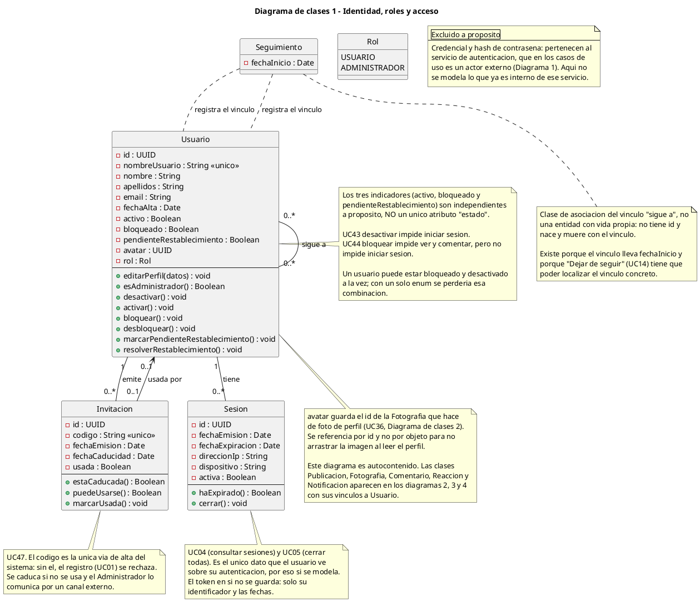
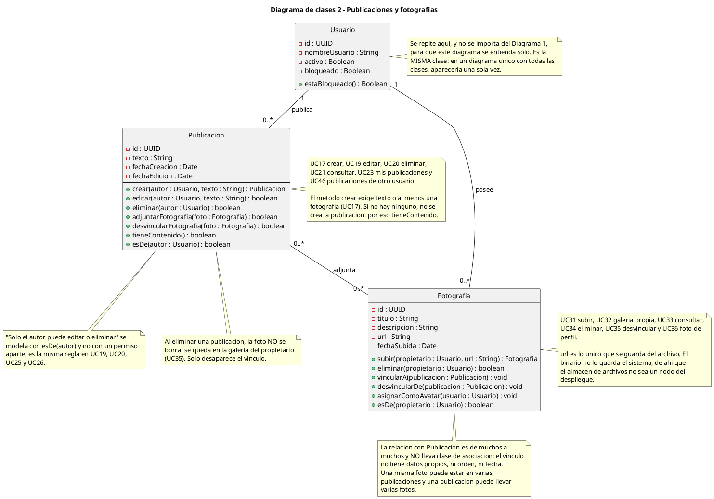
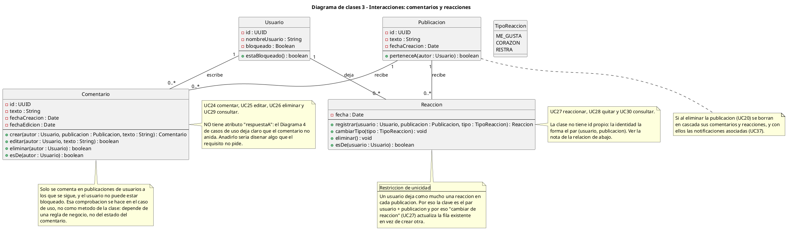
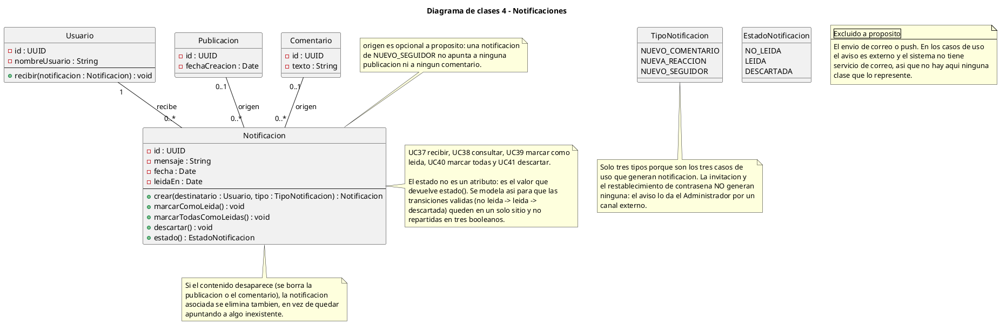

# Diagramas de clases - Photos APP

Modelado estático de la estructura del sistema: qué clases existen, qué atributos
tienen y cómo se relacionan. Es la traducción de los casos de uso
([`casos-de-uso.md`](casos-de-uso.md)) a datos, y va **antes** que el modelo
entidad-relación: el E-R dirá cómo se guarda esto en tablas, el diagrama de clases
dice qué significa.

Código fuente en `docs/diagramas/clases/`. Documento generado en parte con
`docs/sync-diagramas.ps1`, que vuelca cada `.puml` dentro de su bloque para que el
texto y el diagrama no puedan desincronizarse.

## Convenciones

| Convención | Significado |
| ---------- | ----------- |
| `-` | Privado |
| `+` | Público |
| `<<unico>>` | Unicidad de negocio, no de base de datos (la implementa el esquema) |
| Sin `0..*` | La multiplicidad es `1` por defecto; se escribe solo cuando no es `1` |
| Sin tildes en el `.puml` | Evita problemas de codificación al renderizar en el servidor público. En este `.md` sí se usan |

Los diagramas se dibujan en `PlantUML` y se renderizan como SVG.

## Por qué cuatro diagramas y no uno

Un solo diagrama con las 13 clases del sistema es un rectángulo con 30 líneas
cruzándose encima. Partido en cuatro se lee por partes y cada parte se entiende
sola.

El reparto sigue los cuatro bloques en los que ya están divididos los casos de uso:

| # | Diagrama | Clases | Casos de uso |
| - | -------- | ------ | ------------ |
| 1 | Identidad, roles y acceso | `Usuario`, `Rol`, `Seguimiento`, `Invitacion`, `Sesion` | UC01–UC08, UC13, UC14, UC16, UC42–UC45, UC47 |
| 2 | Publicaciones y fotografías | `Publicacion`, `Fotografia` | UC17–UC23, UC31–UC36, UC46 |
| 3 | Interacciones | `Comentario`, `Reaccion`, `TipoReaccion` | UC24–UC30 |
| 4 | Notificaciones | `Notificacion`, `TipoNotificacion`, `EstadoNotificacion` | UC37–UC41 |

**Cada diagrama es autocontenido.** `Usuario` aparece en los cuatro, cada vez con
solo los atributos que ese diagrama necesita, y una nota lo aclara. Es una
decisión conscious: hace que se pueda leer el diagrama 3 sin tener el 1 delante.

El precio es que `Usuario` se repite cuatro veces, lo que se nota al pegar los
cuatro diagramas. La alternativa (importar clases entre diagramas) obliga a
arrastrar el diagrama 1 para entender el 3, que es justo lo que se quería evitar.

> En un diagrama único de clases, `Usuario` aparecería una sola vez. Estos cuatro
> son vistas, no cuatro sistemas distintos.

## Decisiones de modelado

Estas decisiones son las que un lector discutirá primero, así que se dejan
escritas y justificadas en vez de dejarse adivinar por el diagrama:

| # | Decisión | Por qué |
| - | -------- | ------- |
| 1 | `activo`, `bloqueado` y `pendienteRestablecimiento` son **tres booleanos independientes**, no un `enum Estado` | UC43 (desactivar) impide iniciar sesión y UC44 (bloquear) impide ver y comentar, pero **no** impide iniciar sesión: son reglas distintas. Un usuario puede estar bloqueado y desactivado a la vez, y con un único enum esa combinación se pierde |
| 2 | `Seguimiento` es **clase de asociación** entre `Usuario` y `Usuario` | El vínculo lleva `fechaInicio` y UC14 (dejar de seguir) tiene que poder localizar el vínculo concreto para borrarlo. Sin clase de asociación no hay dónde poner la fecha ni cómo identificar el vínculo |
| 3 | La relación `Publicacion`–`Fotografia` es N:M **sin** clase de asociación | El vínculo no tiene datos propios: ni orden, ni fecha, ni atributos. Ponerle una clase sería inventar información que no existe |
| 4 | `Reaccion` **no tiene id propio**: su identidad es el par (usuario, publicación) | Un usuario deja como mucho una reacción por publicación. Si tuviera id, cambiar de reacción crearía una fila nueva y aparecerían dos reacciones del mismo usuario |
| 5 | `Notificacion.estado()` es un **método**, no un atributo | Así las transiciones válidas (no leída → leída → descartada) quedan en un solo sitio. Con tres booleanos (`leida`, `descartada`, ...) se podrían combinar en estados imposibles |
| 6 | `Notificacion.origen` es **opcional (0..1)** | Una notificación de `NUEVO_SEGUIDOR` no apunta a ninguna publicación ni a ningún comentario. Si fuera obligatorio, ese tipo no se podría guardar |
| 7 | `Usuario.avatar` guarda un **id**, no un objeto `Fotografia` | Para no arrastrar la imagen al leer el perfil. Una referencia por id es la solución estándar y aquí además evita el acoplamiento entre el diagrama 1 y el 2 |
| 8 | El estado de `Invitacion` se modela con `usada : Boolean` + `fechaCaducidad`, no con un enum | Una invitación usada **y** caducada a la vez es un estado real (se usó justo el día que expiraba). Con un solo enum habría que decidir cuál de las dos cosas mostrar |

---

# Diagrama de clases 1 — Identidad, roles y acceso

- **Objetivo:** quién es el usuario, qué roles tiene y qué pasa con su cuenta.
- **Clases:** `Usuario`, `Rol`, `Seguimiento`, `Invitacion`, `Sesion`.
- **Casos de uso:** UC01–UC08 (acceso), UC13/UC14 (seguimiento), UC42–UC45 y
  UC47 (administración).

**Lo que este diagrama deja fuera a propósito:** `Credencial` y el hash de la
contraseña. Esos datos pertenecen al servicio de autenticación, que en los casos
de uso es un **actor externo** (Diagrama 1). No se modela como clase lo que ya es
interno de otro sistema.

---

# Diagrama de clases 2 — Publicaciones y fotografías

- **Objetivo:** el contenido que se crea, y su relación con la galería personal.
- **Clases:** `Publicacion`, `Fotografia`.
- **Casos de uso:** UC17–UC23 y UC46 (publicaciones), UC31–UC36 (fotografías).

**Regla que atraviesa los dos diagramas 1 y 2:** borrar una publicación **no**
borra sus fotografías. La foto se queda en la galería de su propietario (UC35) y
lo que desaparece es solo el vínculo. Es lo que hace que UC35 (desvincular) y UC20
(eliminar publicación) no sean la misma operación.

---

# Diagrama de clases 3 — Interacciones: comentarios y reacciones

- **Objetivo:** lo que los usuarios hacen con las publicaciones de otros.
- **Clases:** `Comentario`, `Reaccion`, `TipoReaccion`.
- **Casos de uso:** UC24–UC30.

**La asimetría entre `Comentario` y `Reaccion` es deliberada.** El comentario
tiene `id` y admite N por publicación; la reacción no tiene `id` y admite una por
usuario y publicación. No es descuido: el requisito dice explícitamente que solo
se puede tener una reacción activa, y eso se modela en la identidad de la clase,
no en un método que la compruebe.

---

# Diagrama de clases 4 — Notificaciones

- **Objetivo:** los avisos que genera el sistema dentro de la aplicación.
- **Clases:** `Notificacion`, `TipoNotificacion`, `EstadoNotificacion`.
- **Casos de uso:** UC37–UC41.

---

## Cobertura: caso de uso → clase

Las 47 clases de uso que tienen efecto sobre los datos. Lo que no aparece aquí no
afecta al modelo de datos, solo a la interfaz.

| Caso de uso | Efecto en el modelo | Clase |
| ----------- | ------------------- | ----- |
| UC01 Registrarse | Crea `Usuario` y marca `Invitacion.usada` | `Usuario`, `Invitacion` |
| UC02 Iniciar sesión | Crea `Sesion` | `Sesion` |
| UC03 Cerrar sesión | `Sesion.activa = false` | `Sesion` |
| UC04 Consultar sesiones | Lectura | `Sesion` |
| UC05 Cerrar todas | `Sesion.activa = false` en todas | `Sesion` |
| UC06 Recuperar contraseña | `Usuario.pendienteRestablecimiento = true` | `Usuario` |
| UC07 Cambiar contraseña | Actualiza la credencial (en `Security`) | — |
| UC08 Autenticar usuario | Lo ejecuta `Security`; aquí no hay nada que modelar | — |
| UC09 Ver perfil propio | Lectura | `Usuario` |
| UC10 Editar perfil | Actualiza `nombre`, `apellidos`, `email`, `avatar` | `Usuario` |
| UC11 Ver perfil de otro | Lectura | `Usuario` |
| UC12 Buscar usuarios | Lectura | `Usuario` |
| UC13 Seguir usuario | Crea `Seguimiento` | `Seguimiento` |
| UC14 Dejar de seguir | Borra `Seguimiento` | `Seguimiento` |
| UC15 Consultar conexiones | Lectura | `Seguimiento` |
| UC16 Eliminar mi cuenta | Borra `Usuario` y su contenido en cascada | `Usuario` |
| UC17 Crear publicación | Crea `Publicacion` | `Publicacion` |
| UC18 Adjuntar fotografía | Crea el vínculo N:M | `Publicacion`, `Fotografia` |
| UC19 Editar publicación | Actualiza `texto`, `fechaEdicion` | `Publicacion` |
| UC20 Eliminar publicación | Borra `Publicacion` y sus comentarios, reacciones y notificaciones | `Publicacion` |
| UC21 Consultar publicación | Lectura | `Publicacion` |
| UC22 Consultar feed | Lectura agregada sobre `Seguimiento` | `Seguimiento`, `Publicacion` |
| UC23 Mis publicaciones | Lectura | `Publicacion` |
| UC24 Comentar | Crea `Comentario` y `Notificacion` | `Comentario`, `Notificacion` |
| UC25 Editar comentario | Actualiza `texto`, `fechaEdicion` | `Comentario` |
| UC26 Eliminar comentario | Borra `Comentario` y su `Notificacion` | `Comentario`, `Notificacion` |
| UC27 Reaccionar | Crea o actualiza `Reaccion` y crea `Notificacion` | `Reaccion`, `Notificacion` |
| UC28 Quitar reacción | Borra `Reaccion` y su `Notificacion` | `Reaccion`, `Notificacion` |
| UC29 Consultar comentarios | Lectura | `Comentario` |
| UC30 Consultar reacciones | Lectura | `Reaccion` |
| UC31 Subir fotografía | Crea `Fotografia` | `Fotografia` |
| UC32 Galería propia | Lectura | `Fotografia` |
| UC33 Consultar fotografía | Lectura | `Fotografia` |
| UC34 Eliminar fotografía | Borra `Fotografia` y sus vínculos | `Fotografia` |
| UC35 Desvincular fotografía | Borra solo el vínculo | `Publicacion`, `Fotografia` |
| UC36 Actualizar foto de perfil | `Usuario.avatar` apunta a otra `Fotografia` | `Usuario`, `Fotografia` |
| UC37 Recibir notificación | Crea `Notificacion` | `Notificacion` |
| UC38 Consultar notificaciones | Lectura | `Notificacion` |
| UC39 Marcar como leída | `estado() = LEIDA` | `Notificacion` |
| UC40 Marcar todas como leídas | `estado() = LEIDA` en todas | `Notificacion` |
| UC41 Descartar notificación | `estado() = DESCARTADA` | `Notificacion` |
| UC42 Consultar usuarios | Lectura | `Usuario` |
| UC43 Activar/desactivar cuenta | `Usuario.activo` | `Usuario` |
| UC44 Bloquear/desbloquear | `Usuario.bloqueado` | `Usuario` |
| UC45 Restablecer contraseña | Actualiza la credencial y limpia `pendienteRestablecimiento` | `Usuario` |
| UC46 Publicaciones de otro | Lectura | `Publicacion` |
| UC47 Emitir invitación | Crea `Invitacion` | `Invitacion` |

## Qué NO se modela, y por qué

| No modelado | Motivo |
| ----------- | ------ |
| `Credencial`, hash de contraseña | Es interno del servicio de autenticación, que es un actor externo en los casos de uso |
| Token JWT | Vive en el servicio de autenticación y en el navegador. Solo se guarda su identificador y sus fechas en `Sesion` |
| Envío de correo o push | No hay servicio de correo: el aviso de invitación y el de contraseña los da el Administrador por un canal externo |
| Envío de la notificación | La notificación es un registro en la base de datos. "Envíarla" no es una operación con estado propio |
| Almacén de archivos | El sistema guarda la **URL** de la fotografía, no el binario. Si algún día guarda el archivo, aparece un nodo nuevo en el despliegue y una `url` deja de bastar |
| Pulsar el botón de publicar | No es un objetivo de actor: en los casos de uso está excluido explícitamente (§1.7 de `casos-de-uso.md`) |
| Moderación y reportes | El Administrador es mínimo y no modera. Si se añadiera moderación, aparecería `Reporte` y una relación con `Publicacion` |

## Lo que hay que decidir antes del modelo E-R

Estas seis decisiones siguen abiertas. No se han dibujado en ningún diagrama para
no dar por hecha una respuesta:

1. **Verificación de correo.** El modelo asume que `email` existe pero no se
   valida. Si se decide validarlo, `Usuario` necesita un atributo de verificación
   y UC01 ganaría una fase.
2. **Comentar sin seguir.** El requisito dice que se comenta a quien se sigue.
   `Comentario` no puede imponer eso sola: depende de `Seguimiento`, así que la
   regla vive fuera de la clase.
3. **Consultar conexiones.** UC15 mezcla "a quién sigo" y "quién me sigue" en
   un caso de uso. Son dos lecturas distintas de `Seguimiento`; si se separan en
   dos UC, el modelo no cambia, pero el diagrama de casos de uso sí.
4. **Cambiar de tipo de reacción.** Los casos de uso cubren reaccionar y quitar,
   no cambiar. El diagrama 3 asume que la misma acción sirve para cambiar
   (decisión 4 de la tabla del principio). Si fuera un caso de uso aparte, habría
   que añadirlo.
5. **Notificarse a uno mismo.** Reaccionar o comentar en tu propia publicación:
   ¿genera notificación? El diagrama 4 asume que no.
6. **Filtro del feed con bloqueados.** UC44 dice que un bloqueado no ve
   publicaciones, pero no concreta si el filtro es en el feed, en la ficha de
   perfil o en ambos. El modelo no lo impone; hay que elegirlo antes de escribir
   el E-R.

## Relación con el resto de la documentación

- Los casos de uso de los que sale este modelo: [`casos-de-uso.md`](casos-de-uso.md)
- El orden de los mensajes dentro de cada clase: [`secuencia.md`](secuencia.md)
- Dónde se ejecuta cada clase: [`despliegue.md`](despliegue.md)
