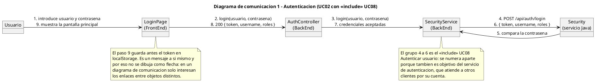

# Diagramas de comunicación - Photos APP

Los diagramas de comunicación muestran **quién collaborate con quién**, sin
orden. Es la misma información que un diagrama de secuencia pero mirada desde otro
ángulo: en lugar de la línea de tiempo, se ve la red de objetos y enlaces.

Código fuente en `docs/diagramas/comunicacion/`. Los bloques de este documento se
generan con `docs/sync-diagramas.ps1`.

## Para qué sirven si ya hay diagramas de secuencia

Porque la pregunta que responden es distinta:

- El diagrama de secuencia dice: *¿en qué orden se llama a cada uno?*
- El diagrama de comunicación dice: *¿qué objetos están conectados entre sí, y
  cuánto depende cada uno de los demás?*

Ejemplo real del proyecto: en el diagrama 4 de notificaciones se ve que
`NotificacionService` es el objeto con más conexiones, y que las notificaciones
salen de `ComentarioService` y de `ReaccionService` y no de la base de datos. Eso
no se aprecia leyendo los diagramas de secuencia uno detrás de otro, porque cada
uno enseña una parte.

## Cómo están hechos

PlantUML **no tiene un tipo de diagrama de comunicación propio en su versión
actual**: la sintaxis clásica (objetos + enlaces + mensajes numerados con un
segundo bloque `@startuml`) devuelve un error de sintaxis. Se ha comprobado con
varias variantes.

La forma que sí funciona, y que produce exactamente la misma figura, es usar
`object` con `left to right direction` y poner los mensajes numerados **en la
etiqueta del enlace**, separados por `\n`:

```text
object "Usuario" as U
object "LoginPage" as UI
U --> UI : 1. introduce usuario y contrasena\n9. muestra la pantalla principal
```

El resultado es ancho y plano, con cajas y flechas numeradas: la forma de un
diagrama de comunicación. La diferencia con la sintaxis original es que no hay un
flecha por mensaje, sino una por par de objetos, con todos los mensajes que
circulan entre ellos.

Esa limitación tiene una consecuencia práctica: **si dos objetos se hablan en
muchos pasos distintos, hay que resumirlos**. Por eso los diagramas agrupan
mensajes en un solo enlace en vez de dibujarlos uno a uno.

## Por qué cuatro diagramas y no ocho

Un diagrama de comunicación por cada flujo doblaría el número de diagramas de
secuencia para repetir la misma información. La regla que se ha seguido es: **uno
por grupo de objetos que collaborates entre sí**, no uno por caso de uso.

| # | Diagrama | Objetos que conecta | Casos de uso |
| - | -------- | ------------------- | ------------ |
| 1 | Autenticación | `Usuario` → `LoginPage` → `AuthController` → `SecurityService` → `Security` | UC02, UC08 |
| 2 | Publicaciones | `Usuario` → `PublicacionPage` → `PublicacionController` → `PublicacionService` / `FotografiaService` → `PostgreSQL` | UC17, UC18, UC31 |
| 3 | Interacciones | `Usuario` → `PublicacionPage` → `ComentarioService` / `ReaccionService` → `NotificacionService` → `PostgreSQL` | UC24, UC27 |
| 4 | Notificaciones | `ComentarioService`, `ReaccionService` → `NotificacionService` → `BandejaPage` → `PostgreSQL` | UC37, UC38 |

El criterio es el bloque de objetos, no el flujo: el diagrama 3 junta comentar y
reaccionar porque comparten tres de los cinco objetos. Y hay dos bloques que
sobran como diagrama propio: el alta de sesión ya se ve en el 1, y la
administración de cuentas (UC42–UC45) no cruza más de dos objetos.

---

# Diagrama 1 — Autenticación (UC02 con «include» UC08)

El mismo recorrido que el diagrama de secuencia 1, pero se ve una cosa que allí
no: que `Security` (el servicio Java) está **al final de la cadena y no se puede
sustituir**. Todo el camino de autenticación depende de él.



# Diagrama 2 — Crear publicación con fotografía (UC17, UC18, UC31)

Se ve que `FotografiaService` y `PublicacionService` son caminos paralelos que se
vuelven a juntar en `PostgreSQL`: la foto se guarda antes de que exista la
publicación, y eso obliga al `FrontEnd` a hacer dos llamadas.

```plantuml
@startuml
title Diagrama de comunicacion 2 - Crear publicacion con fotografia (UC17, UC18, UC31)

left to right direction
skinparam shadowing false
hide circle

object "Usuario" as U
object "PublicacionPage\n(FrontEnd)" as UI
object "PublicacionController\n(BackEnd)" as PC
object "PublicacionService\n(BackEnd)" as PS
object "FotografiaService\n(BackEnd)" as FS
database "PostgreSQL" as DB

U --> UI : 1. escribe el texto\n2. elige una foto o un archivo\n6. publica
UI --> FS : 3. POST /api/fotografias\n(UC31, si la foto es nueva)
FS --> DB : 4. guarda la url de la foto
DB --> FS : 5. fotografia creada
FS --> UI : 5b. 201 fotografia
UI --> PC : 7. POST /api/publicaciones
PC --> PS : 8. crear(autor, texto, fotos)
PS --> DB : 9. inserta la publicacion\n10. crea el vinculo con la foto (UC18)
DB --> PS : 11. publicacion creada
PS --> PC : 12. 201 publicacion
PC --> UI : 13. 201 publicacion
UI --> U : 14. visible en el feed

note bottom of PS
  Si no hay texto ni ninguna foto, se para
  en el paso 8 y se responde 400: la
  publicacion no llega a crearse.
end note

note bottom of DB
  La fotografia se guarda en la galeria del
  propietario aunque luego se desvincule de
  la publicacion (UC35). Borrar la
  publicacion no borra la foto.

  El microservicio de fotos no aparece: hoy
  ningun flujo lo llama.
end note
@enduml
```

# Diagrama 3 — Comentar y reaccionar (UC24 y UC27)

```plantuml
@startuml
title Diagrama de comunicacion 3 - Comentar y reaccionar (UC24 y UC27)

left to right direction
skinparam shadowing false
hide circle

object "Usuario" as U
object "PublicacionPage\n(FrontEnd)" as UI
object "ComentarioController\n(BackEnd)" as CC
object "ComentarioService\n(BackEnd)" as CS
object "ReaccionController\n(BackEnd)" as RC
object "ReaccionService\n(BackEnd)" as RS
object "NotificacionService\n(BackEnd)" as NS
database "PostgreSQL" as DB

U --> UI : 1. escribe el comentario\n6. elige una reaccion
UI --> CC : 2. POST /api/publicaciones/{id}/comentarios
CC --> CS : 3. crear(autor, publicacion, texto)
CS --> DB : 4. comprueba que sigue al dueno\n4b. inserta el comentario
CS --> NS : 5. crear(dueno, NUEVO_COMENTARIO)
UI --> RC : 7. POST /api/publicaciones/{id}/reacciones
RC --> RS : 8. registrar(usuario, publicacion, tipo)
RS --> DB : 9. busca la reaccion de ese usuario\na esa publicacion
RS --> DB : 10. inserta o actualiza la reaccion
RS --> NS : 11. crear(dueno, NUEVA_REACCION)
NS --> DB : 12. guarda la notificacion
DB --> RC : 13. la reaccion aparece en la publicacion
DB --> CC : 14. el comentario aparece en la lista

note bottom of CS
  Comentar y reaccionar son dos caminos
  independientes que comparten tres cosas:
  la misma pagina, la misma publicacion y el
  mismo servicio de notificaciones. Se
  dibujan juntos porque en un diagrama de
  comunicacion lo que se ve es quien
  collaborate con quien, no el orden.
end note

note bottom of NS
  La notificacion se lanza DESPUES de
  guardar, y aunque falle, el comentario o
  la reaccion ya estan. Por eso no es un
  «include»: no es un subobjetivo del caso
  de uso, es una reaccion del sistema ante
  otro actor.
end note

note bottom of RS
  Un usuario deja una sola reaccion por
  publicacion: si ya habia reaccionado, el
  paso 10 actualiza el tipo en vez de crear
  una fila nueva.
end note
@enduml
```

# Diagrama 4 — Notificaciones (UC37 y UC38)

El único diagrama donde `NotificacionService` está en el centro, y el que mejor
justifica haberlo separado del resto de servicios.

```plantuml
@startuml
title Diagrama de comunicacion 4 - Notificaciones (UC37 y UC38)

left to right direction
skinparam shadowing false
hide circle

object "Usuario" as U
object "ComentarioService\n(BackEnd)" as CS
object "ReaccionService\n(BackEnd)" as RS
object "NotificacionService\n(BackEnd)" as NS
object "NotificacionController\n(BackEnd)" as NC
object "BandejaPage\n(FrontEnd)" as UI
database "PostgreSQL" as DB

CS --> NS : 1. crear(duevo, NUEVO_COMENTARIO)
RS --> NS : 2. crear(duevo, NUEVA_REACCION)
NS --> DB : 3. guarda la notificacion
U --> UI : 4. abre su bandeja
UI --> NC : 5. GET /api/notificaciones
NC --> NS : 6. listar(usuario)
NS --> DB : 7. notificaciones del usuario\nordenadas por fecha desc
DB --> NS : 8. listado
NS --> NC : 9. notificaciones
NC --> UI : 10. 200 listado
UI --> U : 11. muestra las no leidas primero

note bottom of NS
  NotificacionService es el UNICO punto por
  el que se crean notificaciones. Por eso es
  el objeto mas conectado del diagrama: en
  cuanto se anada otro motor (un seguidor
  nuevo), entra aqui y no en otro sitio.
end note

note bottom of DB
  Al borrar el comentario (UC26) o la
  reaccion (UC29) se borra tambien su
  notificacion: no puede quedar apuntando a
  algo que ya no existe.
end note

note bottom of UI
  Lo que NO aparece y por que:
  - No hay correo ni push. El aviso es
    dentro de la aplicacion.
  - No hay confirmacion de lectura. El caso
    de uso dice "ver" las notificaciones,
    no "marcar como leidas": anadir ese
    estado seria inventar una funcionalidad.
end note
@enduml
```

---

## Cobertura

| Diagrama | Casos de uso | Diagrama de secuencia equivalente |
| -------- | ------------ | --------------------------------- |
| 1 · Autenticación | UC02, UC08 | Secuencia 1 |
| 2 · Publicaciones | UC17, UC18, UC31 | Secuencia 4 |
| 3 · Interacciones | UC24, UC27 | Secuencia 6 y 7 |
| 4 · Notificaciones | UC37, UC38 | — (no hay uno propio) |

El diagrama 4 de comunicación **no tiene equivalente de secuencia**: es la vista
más rápida para entender que las notificaciones se crean siempre en el mismo
sitio.

## Qué se ha dejado fuera

| No aparece | Motivo |
| ---------- | ------ |
| Los caminos de error | Un diagrama de comunicación no tiene eje temporal donde colocar un `alt`, y los errores son un problema de orden más que de estructura |
| Los mensajes de un objeto a sí mismo | Un mensaje a sí mismo no crea ningún enlace, y en un grafo de enlaces no se representa |
| `Security` en los diagramas 2, 3 y 4 | Solo participa en la autenticación. Dibujarlo en flujos donde no aparece sugeriría una dependencia que no existe |
| El microservicio de fotos | Es el mismo caso que en los diagramas de secuencia: está levantado, pero ningún flujo lo llama |
| Más de una instancia de un objeto | No hay carga ni réplicas. Dos cajas con el mismo nombre serían dos clases distintas a ojos del grafo |

## Relación con el resto de la documentación

- El orden de los mismos mensajes: [`secuencia.md`](secuencia.md)
- Las clases que forman cada objeto: [`clases.md`](clases.md)
- Dónde se ejecuta cada nodo: [`despliegue.md`](despliegue.md)
