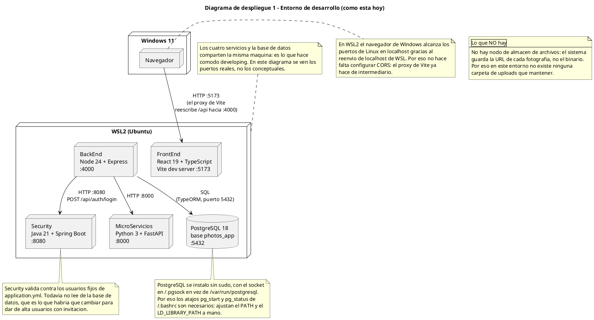
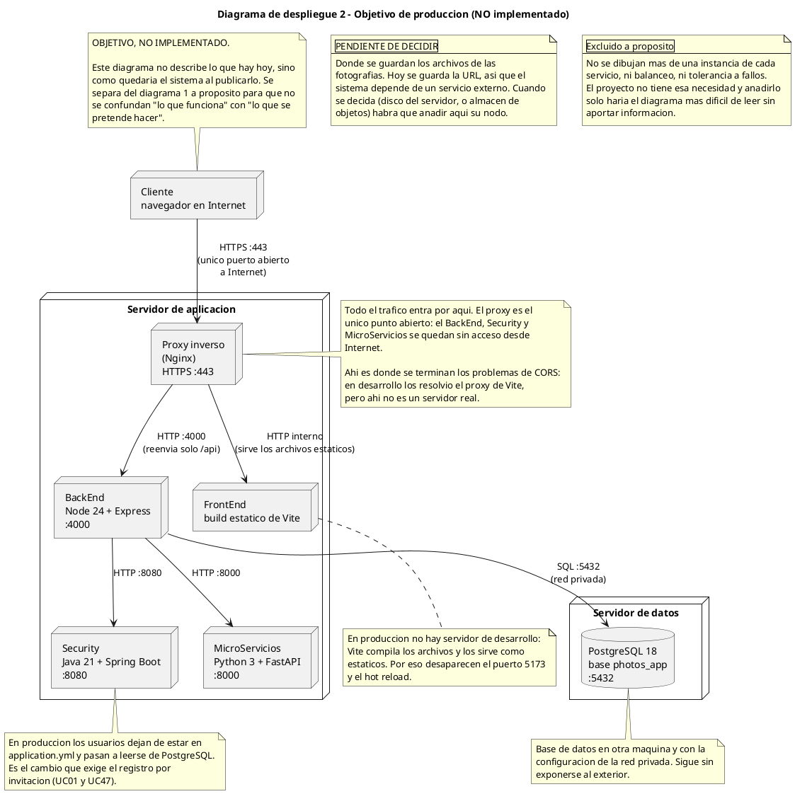

# Diagramas de despliegue - Photos APP

Los diagramas de despliegue muestran **dónde se ejecuta cada pieza**: qué
servidores, qué puertos, qué procesos y cómo se comunican entre ellos. Es la
vista que convierte el software en algo que se puede instalar y arrancar.

Código fuente en `docs/diagramas/despliegue/`. Los bloques de este documento se
generan con `docs/sync-diagramas.ps1`.

## Por qué están separados desarrollo y producción

Es la decisión más importante de este documento, y por eso hay dos diagramas en
lugar de uno.

Un diagrama de despliegue único tendría que mezclar dos cosas que no se mezclan:

- **Lo que funciona hoy:** cuatro servicios y una base de datos en la misma
  máquina, puertos abiertos, `Vite` haciendo de servidor de desarrollo.
- **Lo que se proyecta:** un servidor con proxy inverso y HTTPS, la base de datos
  en otra máquina, los servicios sin acceso desde Internet.

Mezclados, el diagrama daría a entender que el proxy inverso y el HTTPS ya están
montados, y no es así. Separados, cada uno se lee con la pregunta correcta: el
primero es "cómo lo arranco hoy", el segundo es "cómo lo publico".

**El diagrama 2 no describe nada implementado.** Está marcado como objetivo en la
propia figura. Se mantiene porque es la respuesta a la pregunta que siempre sale en
la defensa del proyecto —"¿y esto cómo se despliega?"— y porque muestra qué
cambios haría falta. Si en algún momento se implementa, hay que actualizar el
título y las notas para que deje de decir "NO implementado".

## Convenciones

| Convención | Significado |
| ---------- | ----------- |
| `node` | Un equipo o un entorno (Windows, WSL2, un servidor) |
| Caja dentro de un `node` | Un proceso o servicio que corre dentro de ese equipo |
| `database` | Solo para PostgreSQL. Es lo único que guarda datos |
| `X --> Y : protocolo puerto` | La etiqueta lleva siempre el protocolo y el puerto. Un enlace sin puerto en este proyecto es un error |
| Sin tildes en el `.puml` | Evita fallos de codificación en el renderizador público. En este `.md` sí se usan |

## La diferencia entre los dos entornos, resumida

| | Desarrollo (diagrama 1) | Producción (diagrama 2) |
| - | ----------------------- | ----------------------- |
| Equipos | Windows 11 + WSL2 | Un servidor de aplicación + un servidor de datos |
| Puertos visibles | 5173, 4000, 8080, 8000, 5432 | Solo el **443** abierto a Internet |
| Quién sirve el HTML | `Vite` en modo desarrollo | Archivos estáticos tras el proxy |
| Quién resuelve CORS | El proxy de `Vite` | El proxy inverso (Nginx) |
| HTTPS | No | Sí, terminado en el proxy |
| Base de datos | Misma máquina | Otra máquina, red privada |
| Escenario real | **Sí** | **No, es un objetivo** |

La fila de CORS merece la pena: durante el desarrollo nunca hubo que configurar
CORS en el `BackEnd`, porque el proxy de `Vite` reescribe `/api` y el navegador
solo ve un origen. Ese detalle es cómodo hasta que se publica, y es
precisamente lo que el diagrama 2 señala con una nota.

---

# Diagrama 1 — Entorno de desarrollo (cómo está hoy)

Topología real: el navegador en Windows, y todo lo demás en WSL2.

**Sobre el reenvío de localhost de WSL2.** El diagrama se dibujó con el navegador
en un `node` aparte del de los servicios, y eso merece una explicación: en WSL2 el
navegador de Windows alcanza los puertos de Linux en `localhost` porque WSL2
expone esa traducción por el mecanismo de reenvío de localhost. No hay
configuración de red de por medio, y por eso tampoco hay CORS que configurar en
desarrollo.

Es un detalle del entorno, no de la arquitectura, pero se dibujó igualmente
porque es lo que hace que funcione sin configurar ficheros ni IPs fijas.

**Sobre `PostgreSQL`.** Se instaló sin `sudo` y con el socket en `~/.pgsock` en
lugar de `/var/run/postgresql`. Por eso los atajos `pg_start` y `pg_status` de
`~/.bashrc` no son comodidad: sin ellos, `psql` no encuentra el servidor, porque
el `PATH` y el `LD_LIBRARY_PATH` no apuntan a la instalación del usuario.

# Diagrama 2 — Objetivo de producción (**no implementado**)

---

## Inventario: qué corre y en qué puerto

| Proceso | Puerto | Dónde vive hoy | Tecnología |
| ------- | ------ | --------------- | ---------- |
| FrontEnd (Vite) | 5173 | WSL2 | React 19 + TypeScript |
| BackEnd | 4000 | WSL2 | Node 24 + Express + TypeScript |
| Security | 8080 | WSL2 | Java 21 + Spring Boot |
| MicroServicios | 8000 | WSL2 | Python 3 + FastAPI |
| PostgreSQL | 5432 | WSL2 | PostgreSQL 18, base `photos_app` |

## Protocolos por enlace

| Enlace | Protocolo | Nota |
| ------ | --------- | ---- |
| Navegador → FrontEnd | HTTP :5173 | En desarrollo no hay HTTPS; el proxy de `Vite` reescribe `/api` hacia `:4000` |
| BackEnd → PostgreSQL | SQL :5432 | TypeORM. El pool de conexiones es un parámetro de configuración, no un enlace: por eso no se dibuja |
| BackEnd → Security | HTTP :8080 | `POST /api/auth/login`. Es el único microservicio que el `BackEnd` usa de verdad |
| BackEnd → MicroServicios | HTTP :8000 | **Declarado pero sin uso.** `photo.service.ts` va directo a PostgreSQL. `env.ts` lee `PHOTOS_SERVICE_URL` y no lo usa nadie |
| Proxy → BackEnd | HTTP :4000 | Solo en producción, y solo reenviando `/api` |

## Lo que este diagrama destapa

Tres cosas que no se ven en los otros diagramas y que conviene tener presentes:

1. **El `BackEnd` no valida el JWT.** No hay middleware de autenticación, así que
   cualquiera que llegue a `:4000` usa la API. `JWT_SECRET` está en el `.env` y no
   lo lee nadie. Es el punto más urgente de todo el proyecto.
2. **El microservicio de fotos está levantado y no se usa.** Aparece en el
   diagrama porque existe y escucha en el 8000, pero ningún flujo pasa por él. O
   se conecta con el `BackEnd` para el alta de fotos, o se quita del diagrama.
3. **`Security` valida contra dos usuarios fijos** (`admin/admin123` y
   `usuario/usuario123`) declarados en `application.yml`, no contra la base de
   datos. Por eso el registro por invitación (UC01 y UC47), aunque se implemente,
   no funcionaría hasta que `Security` lea de PostgreSQL.

## Qué falta decidir

| Pendiente | Por qué bloquea al diagrama |
| --------- | --------------------------- |
| Dónde se guardan los archivos de las fotografías | Hoy se guarda la **URL**, así que el sistema depende de un servicio externo. Cuando se decida (disco del servidor o almacén de objetos) hay que añadir un nodo nuevo a los dos diagramas |
| Cuántas instancias de cada servicio | Ahora hay una. Si el despliegue tuviera más de una, habría que decidir balanceo, sesiones compartidas y qué pasa con el token |
| Dónde vive la base de datos | En el objetivo está en otra máquina, pero no está decidido si es un servidor propio o un servicio gestionado |
| Si el 8000 se queda o se quita | Depende de la decisión 2 del inventario anterior. Un nodo que no participa en ningún flujo confunde más que ayuda |

## Relación con el resto de la documentación

- Las clases que se ejecutan en cada proceso: [`clases.md`](clases.md)
- Los mensajes entre esos procesos: [`secuencia.md`](secuencia.md)
- La red de colaboración: [`comunicacion.md`](comunicacion.md)
