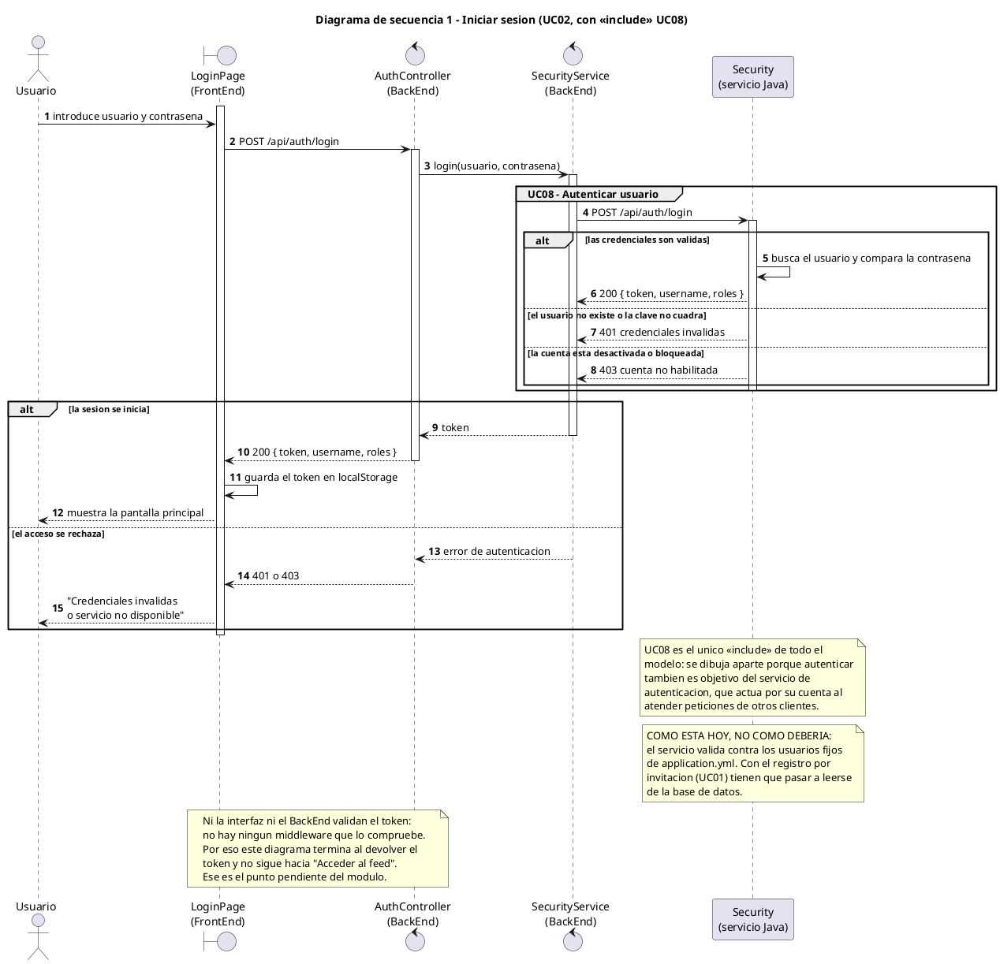
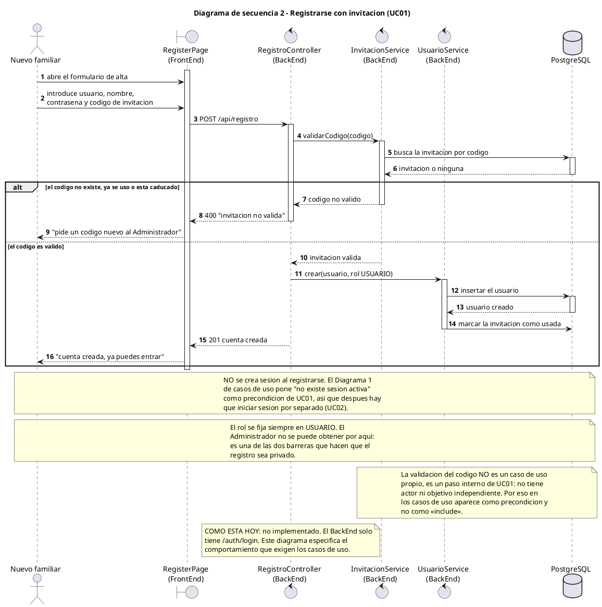
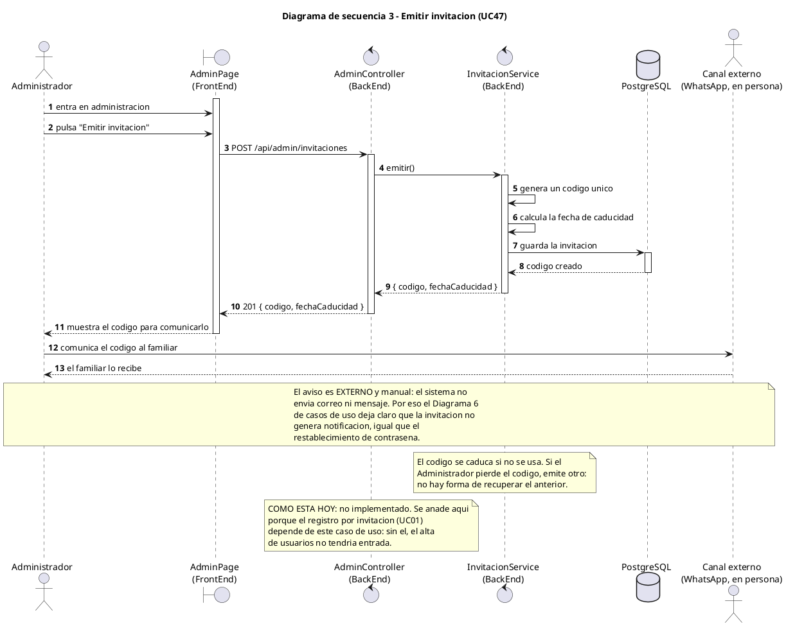
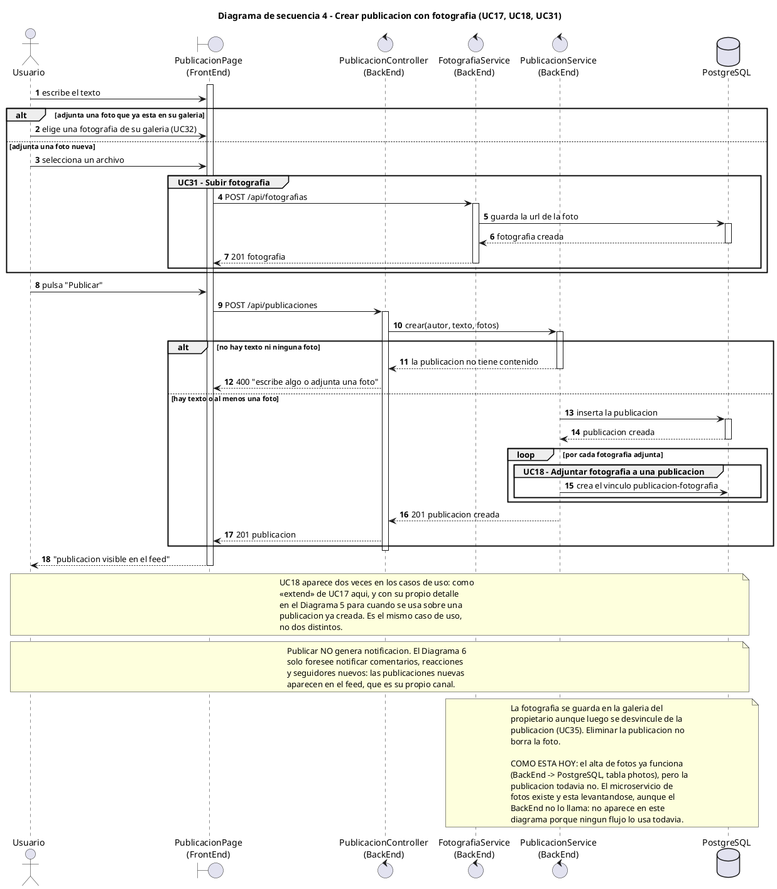
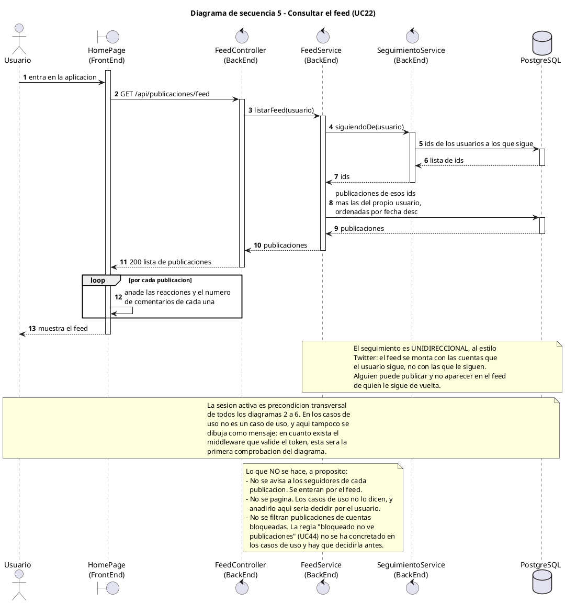
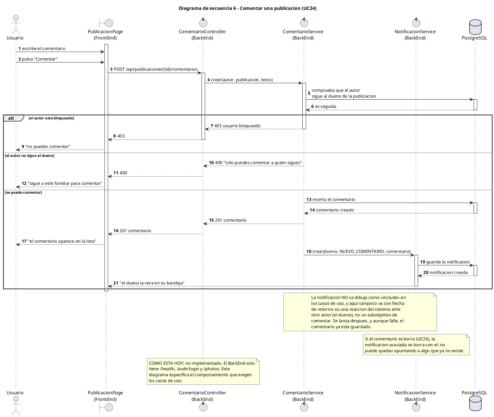
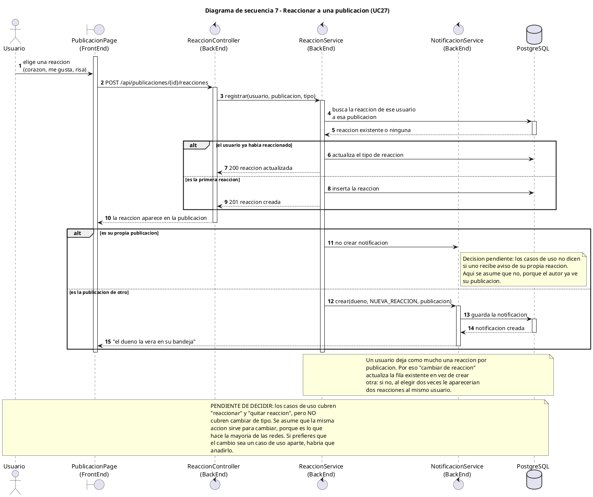
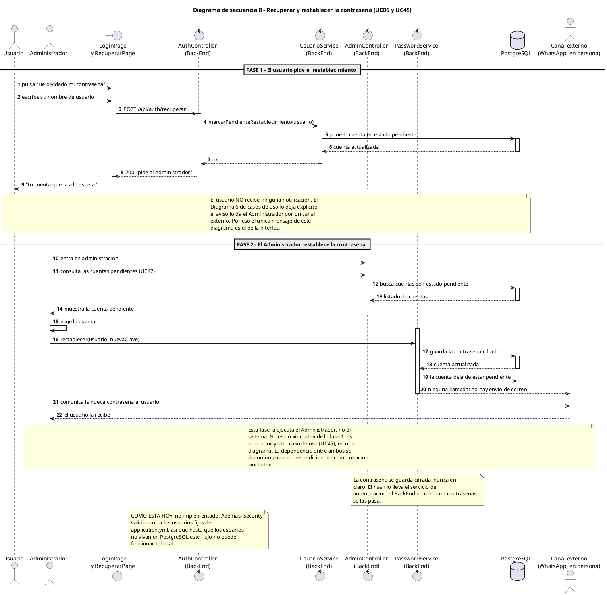

# Diagramas de secuencia - Photos APP

Los diagramas de secuencia muestran **el orden** de los mensajes: quién llama a
quién, en qué momento, y qué se devuelve. Es la vista que responde a la pregunta
"¿qué pasa cuando...?".

Código fuente en `docs/diagramas/secuencia/`. Los bloques de este documento se
generan con `docs/sync-diagramas.ps1`.

## Convenciones

| Convención | Significado |
| ---------- | ----------- |
| `autonumber` | Cada mensaje lleva su número. Al leerlo hay que seguir el orden, no las líneas de Life Line |
| `activate` / `deactivate` | Marca qué objeto está ejecutándose. Se usa solo en las fronteras del sistema, no en cada mensaje |
| `alt` | Camino alternativo: el primero es "se cumple" y los siguientes son las condiciones distintas |
| `opt` | Mensaje opcional |
| `loop` | Repetición |
| `group` | Agrupa mensajes que pertenecen a un mismo caso de uso, sin cambiar el flujo |
| `-->` frente a `->` | Diferencia entre una respuesta y una llamada nueva: la respuesta no gasta un turno del actor |
| Sin tildes en el `.puml` | Evita fallos de codificación en el renderizador público. En este `.md` sí se usan |

> PlantUML **no admite `else` dentro de `group`**: para un camino alternativo hay
> que usar `alt`, que sí se puede anidar dentro de `group`.

## Qué dibujan y qué no

Estos ocho diagramas **describen el comportamiento que exigen los casos de uso**,
no lo que el código hace hoy. La diferencia es real y no es un descuido:

| Diagrama | Estado en el código |
| -------- | ------------------- |
| 1 · Iniciar sesión | **Funciona.** `BackEnd` → `Security` → token |
| 2 · Registrarse con invitación | No implementado |
| 3 · Emitir invitación | No implementado |
| 4 · Crear publicación con fotografía | Parcial: la fotografía sí (`/api/photos`), la publicación no |
| 5 · Consultar el feed | No implementado |
| 6 · Comentar una publicación | No implementado |
| 7 · Reaccionar a una publicación | No implementado |
| 8 · Recuperar y restablecer contraseña | No implementado |

Cada diagrama lleva una nota al pie con su estado. Se marcaron porque un diagrama
de requisitos que se presenta como descripción del sistema sin decirlo lleva a
creer que ya funciona.

**El caso más importante es el 1:** el `BackEnd` **no valida el JWT**. No hay
middleware de autenticación; `GET /api/photos` responde igual con y sin cabecera
`Authorization`, y la variable `JWT_SECRET` existe en el `.env` pero no se usa en
ningún sitio. El diagrama 1 muestra la sesión activa como dato que ya existe; en
cuanto se escriba el middleware, el primer mensaje de los diagramas 2 a 8 será
validar ese token.

## Por qué ocho diagramas

Uno por flujo que un usuario puede iniciar y que tiene un resultado observable
distinto. No hay un diagrama por cada uno de los 47 casos de uso porque:

- Los casos de uso de **consulta** (UC04, UC21, UC29, UC30, UC32, UC33…) son un
  mensaje y una respuesta. Dibujarlos sería hacer 12 diagramas de dos flechas.
- Los casos de uso de **edición** (UC10, UC19, UC25) son el mismo diagrama con
  otro objeto: la diferencia no es estructural, y un diagrama por cada uno solo
  cambiaría el nombre de la clase.
- Un caso de uso por botón, que es el error típico aquí, no aporta nada: el botón
  no es un mensaje, es el momento en que el actor decide enviarlo.

Los ocho cubren los tres actores (Usuario, Administrador) y las cuatro
fronteras del sistema (interfaz, `BackEnd`, `Security`, base de datos).

---

# Diagrama 1 — Iniciar sesión (UC02 con «include» UC08)

El único «include» del sistema, y el único flujo que hoy funciona de verdad.
Se ve por qué `Autenticar usuario` es un caso de uso aparte: lo ejecuta
`Security`, un actor externo, no el `BackEnd`.

# Diagrama 2 — Registrarse con invitación (UC01)

# Diagrama 3 — Emitir invitación (UC47)

Va **antes** que el 2 en el orden del producto, no en el del documento: sin el
UC47 el UC01 no tiene entrada, y así se lee de arriba abajo la cadena
Administrador → invitación → registro.

# Diagrama 4 — Crear publicación con fotografía (UC17, UC18, UC31)

El diagrama más denso, porque aquí caen las dos relaciones «extend» encadenadas:
adjuntar fotografía (UC18) que a su vez extiende con subir fotografía (UC31).

# Diagrama 5 — Consultar el feed (UC22)

# Diagrama 6 — Comentar una publicación (UC24)

# Diagrama 7 — Reaccionar a una publicación (UC27)

# Diagrama 8 — Recuperar y restablecer la contraseña (UC06 y UC45)

Dos fases en un diagrama porque la dependencia entre ellas es justo lo que
interesa documentar: la primera la pide el Usuario, la segunda la resuelve el
Administrador, y **ninguna de las dos genera notificación**.

---

## Cobertura: caso de uso → diagrama

| Diagrama | Casos de uso | Relaciones que se ven |
| -------- | ------------ | ---------------------- |
| 1 · Iniciar sesión | UC02, UC08 | R1 «include» |
| 2 · Registrarse | UC01 | R11 (precondición del código) |
| 3 · Emitir invitación | UC47 | — |
| 4 · Crear publicación | UC17, UC18, UC31 | R5 y R6 «extend» |
| 5 · Consultar feed | UC22 | — |
| 6 · Comentar | UC24 | R8 «trace» a UC37 |
| 7 · Reaccionar | UC27 | R8 «trace» a UC37 |
| 8 · Recuperar contraseña | UC06, UC45, UC42 | R10 «trace» |

**Casos de uso sin diagrama de secuencia, y por qué:**

| Casos de uso | Por qué no tienen uno |
| ------------- | -------------------- |
| UC03, UC04, UC05, UC07, UC15, UC41, UC46 | Un mensaje y una respuesta sobre una clase ya dibujada |
| UC09, UC10, UC11, UC12, UC13, UC14, UC16 | Lectura o edición simple sobre `Usuario` y `Seguimiento` |
| UC19, UC20, UC21, UC23, UC25, UC26, UC28, UC29, UC30 | Igual, sobre `Publicacion`, `Comentario` y `Reaccion` |
| UC32, UC33, UC34, UC35, UC36 | Igual, sobre `Fotografia` |
| UC39, UC40 | Cambian un estado de `Notificacion`, ya visible en el diagrama 4 de comunicación |
| UC42, UC43, UC44 | Administración de cuentas: son cambios de un booleano, visibles en el diagrama 1 de clases |

Si alguno de ellos necesitara un diagrama propio, la regla sería que el flujo
cruza **más de una frontera del sistema** (navegador → `BackEnd` → base de datos
→ `Security`). Ninguno de los de la tabla llega a eso.

## Qué se ha dejado fuera a propósito

| No aparece | Motivo |
| ---------- | ------ |
| Validación de campos, comprobaciones de formato | No son mensajes entre objetos: son detalles internos de un paso. En los casos de uso ya se excluyen (§1.7 de `casos-de-uso.md`) |
| CORS | En desarrollo lo resuelve el proxy de Vite; en producción sería del proxy inverso. Es configuración, no comportamiento |
| Manejo de errores y reintentos | El diagrama marca el camino de error de cada caso (el `alt`), que es lo que el usuario ve. Los reintentos y el *logging* no son requisitos |
| Miniaturas y compresión de imágenes | UC31 dice que se comprueban formato y tamaño, pero no dice que se genere miniatura. Añadirlo sería inventar |
| Envío de correo o push | No hay servicio de correo. El aviso de invitación y el de contraseña son del Administrador, por un canal externo |
| El microservicio de fotos | Existe y se levanta, pero **ningún flujo lo llama**: `photo.service.ts` va directo a PostgreSQL. Aparece en el despliegue pero no aquí, porque no participa en ningún mensaje |
| `Refresh` del token | No está en los casos de uso. Si se añade, sería un noveno diagrama |

## Relación con el resto de la documentación

- Las clases que se llaman aquí: [`clases.md`](clases.md)
- La estructura, sin el orden: [`comunicacion.md`](comunicacion.md)
- Dónde corre cada nodo: [`despliegue.md`](despliegue.md)
- De dónde salen estos flujos: [`casos-de-uso.md`](casos-de-uso.md)
